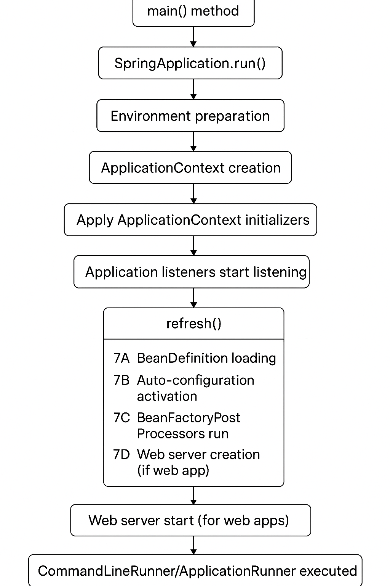

## **Conversation**

### Chat : explain dispatcherservlet both in case of spring and spring boot, how it is working in both secnarios?

Great question. I’ll explain **DispatcherServlet** in a way that matches your background (Java + Spring Boot, microservices) and clearly contrast **Spring (non-Boot)** vs **Spring Boot**.

---

## 1️⃣ What is DispatcherServlet? (Core idea)

`DispatcherServlet` is the **Front Controller** of Spring MVC.

👉 **Every HTTP request** in a Spring MVC application goes through `DispatcherServlet`.

**Main responsibilities**

* Receive incoming HTTP requests
* Find the correct controller
* Call the controller method
* Resolve the view / write response
* Return the response to the client

Think of it as:

> **API Gateway inside a single Spring application**

---

## 2️⃣ How DispatcherServlet works (Common flow – same for Spring & Boot)

This flow is **identical in both Spring and Spring Boot**.

```
Client
  ↓
DispatcherServlet
  ↓
HandlerMapping (find controller)
  ↓
HandlerAdapter (invoke controller method)
  ↓
Controller (@GetMapping, @PostMapping)
  ↓
Service → Repository
  ↓
Return Model / ResponseBody
  ↓
ViewResolver (if MVC)
  ↓
Response to Client
```

### Key internal components

| Component            | Role                          |
| -------------------- | ----------------------------- |
| DispatcherServlet    | Front controller              |
| HandlerMapping       | Maps URL → Controller         |
| HandlerAdapter       | Calls controller method       |
| Controller           | Business logic                |
| ViewResolver         | Resolves view (JSP/Thymeleaf) |
| HttpMessageConverter | JSON ↔ Object (REST APIs)     |

---

## 3️⃣ DispatcherServlet in **Spring (Without Spring Boot)**

Here **YOU configure everything manually**.

### A) How DispatcherServlet is registered

You must explicitly declare it in **web.xml** or via Java config.

### Example: `web.xml`

```xml
<servlet>
    <servlet-name>dispatcher</servlet-name>
    <servlet-class>
        org.springframework.web.servlet.DispatcherServlet
    </servlet-class>
    <init-param>
        <param-name>contextConfigLocation</param-name>
        <param-value>/WEB-INF/spring-mvc.xml</param-value>
    </init-param>
    <load-on-startup>1</load-on-startup>
</servlet>

<servlet-mapping>
    <servlet-name>dispatcher</servlet-name>
    <url-pattern>/</url-pattern>
</servlet-mapping>
```

### B) What you configure manually

* DispatcherServlet registration
* HandlerMappings
* ViewResolvers
* Component scanning
* Message converters
* Jackson (for JSON)
* Error handling

### C) Contexts involved

* **Root ApplicationContext** (services, repositories)
* **Servlet ApplicationContext** (controllers, MVC beans)

👉 You manage both explicitly.

---

## 4️⃣ DispatcherServlet in **Spring Boot**

Spring Boot **auto-configures DispatcherServlet for you**.

You never write `web.xml`.

### A) How it gets registered automatically

When you add:

```xml
spring-boot-starter-web
```

Spring Boot:

* Adds Spring MVC
* Creates DispatcherServlet bean
* Maps it to `/`
* Auto-configures MVC infrastructure

### B) Where this happens internally

`DispatcherServletAutoConfiguration`

```java
@Bean
public DispatcherServlet dispatcherServlet() {
    return new DispatcherServlet();
}
```

Spring Boot also auto-registers:

* HandlerMappings
* HandlerAdapters
* MessageConverters
* Jackson ObjectMapper
* ExceptionResolvers

### C) Your code (minimal)

```java
@SpringBootApplication
public class App {
    public static void main(String[] args) {
        SpringApplication.run(App.class, args);
    }
}
```

That’s it 🚀

---

## 5️⃣ Spring vs Spring Boot – DispatcherServlet comparison

| Aspect             | Spring (Non-Boot) | Spring Boot     |
| ------------------ | ----------------- | --------------- |
| DispatcherServlet  | Manual config     | Auto-configured |
| web.xml            | Required          | ❌ Not used      |
| Component scanning | Manual            | Automatic       |
| JSON support       | Manual            | Auto            |
| ViewResolver       | Manual            | Auto            |
| Startup time       | Slower            | Faster          |
| Boilerplate        | High              | Very low        |

---

## 6️⃣ Request flow example (Spring Boot REST API)

```java
@RestController
@RequestMapping("/users")
public class UserController {

    @GetMapping("/{id}")
    public User getUser(@PathVariable Long id) {
        return userService.findById(id);
    }
}
```

### Runtime flow

```
GET /users/1
 ↓
DispatcherServlet
 ↓
RequestMappingHandlerMapping
 ↓
UserController#getUser()
 ↓
HttpMessageConverter (Jackson)
 ↓
JSON Response
```

---

## 7️⃣ Important interview points (for you)

Since you have **4+ years experience**, these matter:

✔ DispatcherServlet is **framework code**, not developer code
✔ Spring Boot **does not remove DispatcherServlet**, it hides configuration
✔ Same internal MVC flow in both
✔ Boot focuses on **convention over configuration**
✔ In microservices, DispatcherServlet is **per service**, not shared

---

## 8️⃣ Simple one-line summary

> **DispatcherServlet is the heart of Spring MVC.
> Spring requires you to configure it manually, while Spring Boot auto-configures and wires it for you—but the internal working remains exactly the same.**

---

If you want next:

* 🔄 **DispatcherServlet vs Filter vs Interceptor**
* 🔐 **DispatcherServlet + Spring Security flow**
* 📊 **Request lifecycle diagram (detailed)**

Just tell me 👍


### Chat : 
DispatcherServlet vs Filter vs Interceptor
and
DispatcherServlet + Spring Security flow

### Ans :

Perfect follow-up 👍
I’ll explain this **clearly, deeply, and interview-ready**, tailored to your **Spring Boot + microservices + JWT/Security** background.

---

# 1️⃣ DispatcherServlet vs Filter vs Interceptor

## A) High-level comparison (one glance)

| Aspect              | Filter                  | Interceptor               | DispatcherServlet       |
| ------------------- | ----------------------- | ------------------------- | ----------------------- |
| Part of             | Servlet API             | Spring MVC                | Spring MVC              |
| Level               | Container level         | Framework level           | Framework level         |
| Executes            | **Before Spring**       | **Inside Spring**         | **Central entry point** |
| Aware of Controller | ❌ No                    | ✅ Yes                     | ✅ Yes                   |
| Access to Handler   | ❌ No                    | ✅ Yes                     | ✅ Yes                   |
| Typical use         | Security, logging, CORS | Auth, logging, validation | Request routing         |

---

## B) Filter (Servlet Filter)

### 🔹 What it is

* Defined by **Servlet specification**
* Executes **before DispatcherServlet**
* Works for **all requests** (even non-Spring ones)

### 🔹 Lifecycle

```
Client
 ↓
Filter
 ↓
DispatcherServlet
```

### 🔹 Typical use cases

* Spring Security (via `DelegatingFilterProxy`)
* JWT token extraction
* CORS
* Request/Response logging
* Compression

### 🔹 Example

```java
public class MyFilter implements Filter {
    public void doFilter(
        ServletRequest req,
        ServletResponse res,
        FilterChain chain) {

        // before request
        chain.doFilter(req, res);
        // after response
    }
}
```

### 🔹 Key limitation

❌ No access to:

* Controller
* HandlerMethod
* ModelAndView

---

## C) Interceptor (Spring MVC)

### 🔹 What it is

* Spring-specific
* Executes **after DispatcherServlet selects controller**
* Has access to controller & handler info

### 🔹 Lifecycle

```
Client
 ↓
Filter
 ↓
DispatcherServlet
 ↓
Interceptor (preHandle)
 ↓
Controller
 ↓
Interceptor (postHandle)
 ↓
Interceptor (afterCompletion)
```

### 🔹 Methods

```java
preHandle()        // before controller
postHandle()       // after controller, before view
afterCompletion()  // after response
```

### 🔹 Typical use cases

* Authorization checks
* User context setup
* API timing
* Request validation
* Audit logging

### 🔹 Example

```java
public class AuthInterceptor implements HandlerInterceptor {
    public boolean preHandle(...) {
        // check user
        return true;
    }
}
```

---

## D) DispatcherServlet (Front Controller)

### 🔹 What it is

* Central controller of Spring MVC
* Routes requests to controllers

### 🔹 Responsibilities

* Delegate to HandlerMapping
* Invoke controller via HandlerAdapter
* Resolve view / write response
* Handle exceptions

### 🔹 Position

```
Filter → DispatcherServlet → Interceptor → Controller
```

---

## E) When to use what? (Interview gold ⭐)

| Requirement               | Use               |
| ------------------------- | ----------------- |
| JWT parsing               | Filter            |
| Security                  | Filter            |
| CORS                      | Filter            |
| Controller-specific logic | Interceptor       |
| Request routing           | DispatcherServlet |

---

# 2️⃣ DispatcherServlet + Spring Security Flow (JWT-based)

This is **very important for microservices interviews**.

---

## A) High-level flow

```
Client
 ↓
Security Filter Chain
 ↓
DispatcherServlet
 ↓
Controller
 ↓
Response
```

---

## B) Detailed step-by-step flow

### 1️⃣ Client sends request

```
GET /orders
Authorization: Bearer eyJhbGciOi...
```

---

### 2️⃣ Spring Security Filter Chain (BEFORE DispatcherServlet)

Key filters involved:

```
DelegatingFilterProxy
 ↓
SecurityFilterChain
 ↓
JwtAuthenticationFilter (custom)
```

### What happens here:

* Extract JWT from header
* Validate token
* Load UserDetails
* Create Authentication object
* Store it in `SecurityContextHolder`

✔ **Request is authenticated here**

---

### 3️⃣ DispatcherServlet receives request

Now DispatcherServlet:

* Assumes user identity is already set
* Finds controller via HandlerMapping

```
DispatcherServlet
 ↓
HandlerMapping
 ↓
HandlerAdapter
```

---

### 4️⃣ Interceptors (optional)

If you have:

* LoggingInterceptor
* RoleValidationInterceptor

They run **after authentication**.

---

### 5️⃣ Controller execution

```java
@GetMapping("/orders")
public List<Order> getOrders(Authentication auth) {
    return service.getOrders(auth.getName());
}
```

SecurityContext is already populated.

---

### 6️⃣ Response back

```
Controller
 ↓
HttpMessageConverter
 ↓
DispatcherServlet
 ↓
Filters
 ↓
Client
```

---

## C) Complete flow diagram (JWT)

```
Client
  |
  |  HTTP Request
  ↓
Security Filter Chain
  ├─ CORS Filter
  ├─ JwtAuthenticationFilter
  ├─ UsernamePasswordAuthenticationFilter
  |
  ↓
DispatcherServlet
  ├─ HandlerMapping
  ├─ Interceptors
  ├─ Controller
  |
  ↓
Response
```

---

## D) Key interview insights (🔥 very important)

✔ **Spring Security works at Filter level**
✔ Authentication happens **before DispatcherServlet**
✔ Authorization can happen:

* At filter level
* At interceptor level
* At method level (`@PreAuthorize`)
  ✔ DispatcherServlet does NOT handle security directly
  ✔ `SecurityContextHolder` bridges Security → MVC

---

## E) Filter vs Interceptor in Security context

| Task              | Filter          | Interceptor |
| ----------------- | --------------- | ----------- |
| JWT validation    | ✅               | ❌           |
| Authentication    | ✅               | ❌           |
| Role checking     | ✅ / Interceptor | ✅           |
| Controller access | ❌               | ✅           |

---

## 3️⃣ One-line summaries (Interview ready)

* **Filter** → “Container-level, runs before Spring”
* **Interceptor** → “Spring MVC hook around controller”
* **DispatcherServlet** → “Front controller routing all requests”
* **Spring Security** → “Filter-based security framework”

---

## 4️⃣ Want next?

I can explain:

* 🔐 **AuthenticationManager + AuthenticationProvider flow**
* 🧵 **Filter vs OncePerRequestFilter**
* 📦 **Spring Security in API Gateway + microservices**
* 📊 **Sequence diagram for JWT flow**

Just tell me 👌


### Chat : okay, so can you explain me how this all configuration we do in case of spring app as compared to spring boot, in context of dispatcher servlet, view resolver, model, mapping etc?

Excellent question 👍
This is where **Spring vs Spring Boot** really becomes clear. I’ll explain it **layer by layer**, mapping **what YOU configure in Spring** vs **what Spring Boot auto-configures**, specifically for:

* DispatcherServlet
* Handler Mapping
* View Resolver
* Model
* Message Converters

I’ll keep it **conceptual + config-level**, no unnecessary noise.

---

# 1️⃣ Big Picture First

### Traditional Spring (non-Boot)

👉 **You assemble the MVC engine manually**

### Spring Boot

👉 **Spring assembles the MVC engine for you**

Internally the engine is the same.

---

# 2️⃣ DispatcherServlet Configuration

## 🔹 Spring (Without Boot)

You must **register DispatcherServlet explicitly**.

### Option 1: `web.xml`

```xml
<servlet>
    <servlet-name>dispatcher</servlet-name>
    <servlet-class>
        org.springframework.web.servlet.DispatcherServlet
    </servlet-class>
    <load-on-startup>1</load-on-startup>
</servlet>

<servlet-mapping>
    <servlet-name>dispatcher</servlet-name>
    <url-pattern>/</url-pattern>
</servlet-mapping>
```

### Option 2: Java config

```java
public class WebAppInitializer
        extends AbstractAnnotationConfigDispatcherServletInitializer {

    protected Class<?>[] getRootConfigClasses() {
        return new Class[]{ RootConfig.class };
    }

    protected Class<?>[] getServletConfigClasses() {
        return new Class[]{ WebConfig.class };
    }

    protected String[] getServletMappings() {
        return new String[]{ "/" };
    }
}
```

👉 You control **where and how** DispatcherServlet is created.

---

## 🔹 Spring Boot

```java
@SpringBootApplication
public class App {
    public static void main(String[] args) {
        SpringApplication.run(App.class, args);
    }
}
```

✔ DispatcherServlet is:

* Created automatically
* Registered automatically
* Mapped to `/`

Via:

```
DispatcherServletAutoConfiguration
```

❗ You **never touch** DispatcherServlet config unless customizing.

---

# 3️⃣ Handler Mapping (URL → Controller)

## 🔹 Spring

You must explicitly enable MVC:

```java
@Configuration
@EnableWebMvc
@ComponentScan("com.example")
public class WebConfig { }
```

Without `@EnableWebMvc`, mappings won’t work.

---

## 🔹 Spring Boot

✔ Auto-enabled via:

```
spring-boot-starter-web
```

Boot internally registers:

* `RequestMappingHandlerMapping`
* `RequestMappingHandlerAdapter`

You **never add `@EnableWebMvc`** (unless you want full control).

---

# 4️⃣ Controller & Mapping (Same in both)

```java
@Controller
@RequestMapping("/users")
public class UserController {

    @GetMapping("/{id}")
    public String getUser(Model model) {
        model.addAttribute("user", user);
        return "user";
    }
}
```

✔ Controllers work **identically** in Spring & Boot.

---

# 5️⃣ View Resolver Configuration

## 🔹 Spring (Manual)

```java
@Bean
public InternalResourceViewResolver viewResolver() {
    InternalResourceViewResolver vr = new InternalResourceViewResolver();
    vr.setPrefix("/WEB-INF/views/");
    vr.setSuffix(".jsp");
    return vr;
}
```

If you forget this → ❌ view not found error.

---

## 🔹 Spring Boot (Auto)

Add dependency:

```xml
spring-boot-starter-thymeleaf
```

Boot auto-configures:

* `ThymeleafViewResolver`
* Template location
* Prefix & suffix

Optional override:

```properties
spring.thymeleaf.prefix=classpath:/templates/
spring.thymeleaf.suffix=.html
```

✔ Zero Java config.

---

# 6️⃣ Model Handling (Same concept, different setup)

### Model lifecycle (both)

* Controller populates Model
* ViewResolver renders view using Model data

```java
model.addAttribute("name", "Shiva");
```

✔ **No difference in usage**
✔ Difference is only in **view resolver config**

---

# 7️⃣ Message Converters (JSON ↔ Object)

## 🔹 Spring

You must manually add Jackson:

```xml
<dependency>
    <groupId>com.fasterxml.jackson.core</groupId>
</dependency>
```

And configure:

```java
@EnableWebMvc
```

---

## 🔹 Spring Boot

```xml
spring-boot-starter-web
```

✔ Automatically registers:

* MappingJackson2HttpMessageConverter
* Gson (optional)

No config needed.

---

# 8️⃣ Exception Handling

## 🔹 Spring

```java
@ExceptionHandler(Exception.class)
public String handle() { }
```

Needs manual setup.

---

## 🔹 Spring Boot

✔ Auto-registers:

* `BasicErrorController`
* `/error` endpoint
* JSON error responses

Custom:

```java
@ControllerAdvice
```

---

# 9️⃣ Summary Table (Very Important)

| Feature            | Spring          | Spring Boot      |
| ------------------ | --------------- | ---------------- |
| DispatcherServlet  | Manual          | Auto             |
| MVC enablement     | `@EnableWebMvc` | Auto             |
| HandlerMapping     | Manual          | Auto             |
| ViewResolver       | Manual          | Auto             |
| JSON support       | Manual          | Auto             |
| Exception handling | Manual          | Auto             |
| Config style       | Verbose         | Convention-based |

---

# 🔟 Mental Model (Interview-ready)

### Spring

> “Developer wires the MVC engine.”

### Spring Boot

> “Developer uses the MVC engine.”

---

## One-line killer answer 💥

> **Spring Boot does not change how DispatcherServlet, mappings, models, or views work; it only auto-configures and wires them using sensible defaults, while traditional Spring requires explicit configuration for each MVC component.**

---

If you want next:

* 🔁 **What happens when you add @EnableWebMvc in Boot (very common trap)**
* 🧠 **Internal auto-configuration classes walkthrough**
* 📊 **End-to-end request lifecycle diagram**

Just say the word 👌


### Chat : Internal auto-configuration classes walkthrough

Perfect 👍
This is **advanced Spring Boot knowledge** and very interview-relevant for someone with your **Spring Boot + microservices** background.

I’ll walk you through **internal auto-configuration classes**, **in execution order**, and show **what exactly they configure** for MVC, DispatcherServlet, JSON, views, errors, etc.

---

# 1️⃣ First: How auto-configuration is even triggered

Everything starts from:

```java
@SpringBootApplication
```

Which internally equals:

```java
@Configuration
@EnableAutoConfiguration
@ComponentScan
```

👉 **Key annotation:** `@EnableAutoConfiguration`

This tells Spring Boot:

> “Scan classpath → find auto-configuration classes → apply them conditionally.”

---

# 2️⃣ Where auto-configuration classes come from

Spring Boot loads them from:

```
META-INF/spring/org.springframework.boot.autoconfigure.AutoConfiguration.imports
```

(older versions used `spring.factories`)

This file lists **hundreds of auto-configuration classes**.

---

# 3️⃣ MVC Auto-Configuration – Main Players

When you add:

```xml
spring-boot-starter-web
```

These auto-configs kick in 👇

---

## 🔹 1. `DispatcherServletAutoConfiguration`

### What it does

✔ Creates the **DispatcherServlet bean**
✔ Registers it with the servlet container

### Key conditions

```java
@ConditionalOnWebApplication
@ConditionalOnClass(DispatcherServlet.class)
```

### Internally creates:

* `DispatcherServlet`
* `ServletRegistrationBean<DispatcherServlet>`

👉 This replaces **web.xml** entirely.

---

## 🔹 2. `WebMvcAutoConfiguration`

This is the **heart of Spring MVC auto-config**.

### Activated when:

```java
@ConditionalOnMissingBean(WebMvcConfigurationSupport.class)
```

⚠️ This is why **adding `@EnableWebMvc` disables auto-config**
(`@EnableWebMvc` provides `WebMvcConfigurationSupport`)

---

### What `WebMvcAutoConfiguration` sets up

✔ `RequestMappingHandlerMapping`
✔ `RequestMappingHandlerAdapter`
✔ `HandlerExceptionResolver`
✔ `HttpMessageConverters`
✔ `ConversionService`
✔ `Validator`
✔ `LocaleResolver`

👉 This is everything you used to configure manually in Spring.

---

## 🔹 3. `HttpMessageConvertersAutoConfiguration`

### Purpose

Handles:

* JSON ↔ Java
* XML ↔ Java

### Conditions

```java
@ConditionalOnClass(ObjectMapper.class)
```

### Registers

* `MappingJackson2HttpMessageConverter`
* Gson / JSON-B (if present)

👉 This is why `@RestController` “just works”.

---

## 🔹 4. `JacksonAutoConfiguration`

### Purpose

Configures Jackson **ObjectMapper**

### What it does

✔ Date formats
✔ Naming strategies
✔ JavaTimeModule (LocalDate, LocalDateTime)
✔ Custom properties from `application.yml`

```properties
spring.jackson.serialization.WRITE_DATES_AS_TIMESTAMPS=false
```

👉 No manual `ObjectMapper` bean needed.

---

## 🔹 5. View Resolver Auto-Configuration

Depends on which view tech you add.

---

### a) `ThymeleafAutoConfiguration`

Triggered if:

```java
@ConditionalOnClass(ThymeleafViewResolver.class)
```

Configures:

* TemplateResolver
* TemplateEngine
* ThymeleafViewResolver

Defaults:

```
classpath:/templates/
*.html
```

---

### b) `InternalResourceViewResolverAutoConfiguration` (JSP)

Triggered if:

* JSP libs are present

Defaults:

```
/WEB-INF/jsp/
.jsp
```

---

## 🔹 6. `ErrorMvcAutoConfiguration`

### Purpose

Global error handling

Creates:

* `BasicErrorController`
* `/error` endpoint

Supports:

* JSON errors (REST)
* HTML errors (MVC)

Example response:

```json
{
  "status": 404,
  "error": "Not Found",
  "path": "/users/99"
}
```

---

## 🔹 7. `ServletWebServerFactoryAutoConfiguration`

### Purpose

Embedded server setup

Creates:

* Tomcat / Jetty / Undertow
* Port, context path

```properties
server.port=8081
server.servlet.context-path=/api
```

---

# 4️⃣ Execution Order (Important Mental Model)

```
@SpringBootApplication
 ↓
@EnableAutoConfiguration
 ↓
Classpath scanning
 ↓
DispatcherServletAutoConfiguration
 ↓
WebMvcAutoConfiguration
 ↓
HttpMessageConvertersAutoConfiguration
 ↓
JacksonAutoConfiguration
 ↓
ViewResolverAutoConfiguration
 ↓
ErrorMvcAutoConfiguration
```

---

# 5️⃣ Conditional Annotations (VERY IMPORTANT)

Auto-configuration depends heavily on:

| Annotation                  | Meaning                   |
| --------------------------- | ------------------------- |
| `@ConditionalOnClass`       | Class exists in classpath |
| `@ConditionalOnBean`        | Bean already exists       |
| `@ConditionalOnMissingBean` | Bean does NOT exist       |
| `@ConditionalOnProperty`    | Property enabled          |

👉 This is how Boot stays **flexible**.

---

# 6️⃣ What happens if YOU override something?

Example:

```java
@Bean
public ObjectMapper objectMapper() {
    return new ObjectMapper();
}
```

👉 `JacksonAutoConfiguration` backs off
(`@ConditionalOnMissingBean`)

Same for:

* ViewResolver
* MessageConverters
* HandlerMappings

---

# 7️⃣ Common Interview Trap ⚠️

### ❌ Adding `@EnableWebMvc` in Spring Boot

What happens?

* Disables `WebMvcAutoConfiguration`
* You must configure everything manually again

### Correct usage

* Use `WebMvcConfigurer` instead

```java
@Configuration
public class WebConfig implements WebMvcConfigurer {
}
```

---

# 8️⃣ One-Line Interview Summary 💥

> **Spring Boot auto-configuration works by conditionally registering MVC infrastructure beans like DispatcherServlet, HandlerMappings, MessageConverters, ViewResolvers, and ErrorHandlers based on classpath contents and existing beans—removing the need for manual configuration while keeping full override capability.**

---

If you want next (high-value topics for you):

* 🔍 **Live debugging: how to see which auto-configs were applied**
* 🧠 **Why `@EnableWebMvc` breaks Boot**
* 🔐 **Spring Security auto-configuration internals**
* 📦 **Auto-configuration in microservices + API Gateway**

Just tell me 🔥


### Chat : 🔍 Live debugging: how to see which auto-configs were applied

Great topic 🔥
This is **real-world Spring Boot debugging** that senior devs actually use. I’ll show you **practical, step-by-step ways** to see **which auto-configurations were applied, skipped, and why**.

---

# 🔍 How to See Applied Auto-Configurations (Live Debugging)

---

## 1️⃣ EASIEST: Enable Auto-Configuration Report (Recommended)

### Add this to `application.properties` or `application.yml`

```properties
debug=true
```

### OR via JVM arg

```bash
-Ddebug
```

---

### What happens?

On startup, Spring Boot prints a **Condition Evaluation Report** in logs.

You’ll see sections like:

```
============================
CONDITIONS EVALUATION REPORT
============================

Positive matches:
-----------------
DispatcherServletAutoConfiguration matched
WebMvcAutoConfiguration matched
JacksonAutoConfiguration matched

Negative matches:
-----------------
ThymeleafAutoConfiguration did not match
    - @ConditionalOnClass did not find ThymeleafViewResolver
```

### What you learn

✔ Which auto-configs were applied
✔ Which were skipped
✔ Exact **condition reason**

👉 **This is the most important tool to know**

---

## 2️⃣ Actuator: `/actuator/conditions` (BEST for runtime)

If you use Actuator (common in microservices):

### Add dependency

```xml
spring-boot-starter-actuator
```

### Expose endpoint

```properties
management.endpoints.web.exposure.include=conditions
```

### Call endpoint

```
GET /actuator/conditions
```

---

### Sample output (simplified)

```json
{
  "positiveMatches": {
    "WebMvcAutoConfiguration": [
      "matched @ConditionalOnWebApplication",
      "matched @ConditionalOnClass DispatcherServlet"
    ]
  },
  "negativeMatches": {
    "ThymeleafAutoConfiguration": [
      "ThymeleafViewResolver not found"
    ]
  }
}
```

👉 **Best for cloud / prod debugging**

---

## 3️⃣ Programmatic Access (Advanced)

You can access the report inside code:

```java
@Autowired
ConditionEvaluationReport report;
```

Useful for:

* Debug tooling
* Custom diagnostics
* Learning internals

---

## 4️⃣ Logging Only Auto-Configuration Classes

To avoid noisy logs, enable targeted logging:

```properties
logging.level.org.springframework.boot.autoconfigure=DEBUG
```

This shows:

* Which auto-configs were evaluated
* Why they matched / didn’t match

---

## 5️⃣ Identify Who Created a Bean

### Enable bean definition logging

```properties
logging.level.org.springframework.beans.factory.support=DEBUG
```

Startup logs will show:

```
Creating shared instance of bean 'dispatcherServlet'
```

---

## 6️⃣ Inspect Beans at Runtime (Actuator)

### Endpoint

```
GET /actuator/beans
```

Shows:

* Bean name
* Bean type
* Which configuration class created it

Example:

```
dispatcherServlet
  → DispatcherServletAutoConfiguration
```

---

## 7️⃣ IDE Debugging (Power move 💪)

### Step-through these classes:

* `AutoConfigurationImportSelector`
* `DispatcherServletAutoConfiguration`
* `WebMvcAutoConfiguration`

Set breakpoints and watch:

* Condition checks
* Bean creation

👉 Best way to **truly understand Boot internals**

---

## 8️⃣ Common Real-World Scenarios (Very Important)

### ❓ Why is my controller not getting hit?

Check:

* `WebMvcAutoConfiguration` is applied
* `DispatcherServlet` exists

### ❓ Why JSON is not returned?

Check:

* `HttpMessageConvertersAutoConfiguration`
* `JacksonAutoConfiguration`

### ❓ Why Thymeleaf not working?

Check:

* `ThymeleafAutoConfiguration`
* Classpath condition failed

---

## 9️⃣ Microservices Tip (Your context)

In **API Gateway + microservices**:

* Gateway → `WebFluxAutoConfiguration`
* Services → `WebMvcAutoConfiguration`

Use `/actuator/conditions` to confirm:
✔ MVC vs WebFlux
✔ DispatcherServlet vs WebHandler

---

## 🔑 One-Line Interview Answer

> **Spring Boot provides a Condition Evaluation Report, accessible via `debug=true` or `/actuator/conditions`, which shows exactly which auto-configuration classes were applied or skipped and why—making auto-configuration fully transparent and debuggable.**

---

## Want to go deeper next? 🚀

I can explain:

* 🧠 **AutoConfigurationImportSelector internals**
* ⚠️ **Why WebFlux auto-config disables MVC**
* 🔐 **Spring Security auto-config debugging**
* 🧪 **Real debugging scenarios from production**

Just tell me 👌


### Chat : does dispatcherservlet creates the IOC container?

Short answer: **❌ No.**
**DispatcherServlet does NOT create the IoC container.**

Now let’s explain this **clearly, precisely, and interview-ready**, and also cover **Spring vs Spring Boot**, because this confusion is very common.

---

## 1️⃣ Who actually creates the IoC container?

### ✅ **ApplicationContext creates the IoC container**

Not `DispatcherServlet`.

In Spring (web apps), there can be **two ApplicationContexts**:

| Context                        | Purpose                              |
| ------------------------------ | ------------------------------------ |
| **Root ApplicationContext**    | Services, repositories, data sources |
| **Servlet ApplicationContext** | Controllers, MVC beans               |

Both are **IoC containers**.

---

## 2️⃣ Role of DispatcherServlet (what it actually does)

`DispatcherServlet`:

* Is a **Servlet**
* Acts as **Front Controller**
* Uses an already-created **ApplicationContext**
* Does **NOT** manage bean lifecycle itself

Think of it as:

> DispatcherServlet = **traffic controller**, not factory

---

## 3️⃣ Then who creates the ApplicationContext?

### 🔹 In traditional Spring (non-Boot)

#### A) Root ApplicationContext

Created by:

```text
ContextLoaderListener
```

Configured in `web.xml`:

```xml
<listener>
    <listener-class>
        org.springframework.web.context.ContextLoaderListener
    </listener-class>
</listener>
```

This listener creates:

```
Root WebApplicationContext
```

---

#### B) Servlet ApplicationContext

Created by:

```
DispatcherServlet
```

⚠️ Important nuance:

* DispatcherServlet **creates a child ApplicationContext**
* But **DispatcherServlet itself is NOT the IoC container**
* It *initializes* a WebApplicationContext internally

So:
✔ DispatcherServlet **initializes** a context
❌ DispatcherServlet **is not** the container

---

## 4️⃣ In Spring Boot (Embedded container)

Spring Boot simplifies this, but **concept stays same**.

### A) SpringApplication.run()

```java
SpringApplication.run(App.class, args);
```

This:

* Creates the **ApplicationContext**
* Sets up embedded Tomcat
* Registers DispatcherServlet

### B) Context hierarchy in Boot

By default:

```
Single ApplicationContext
```

✔ Root + Servlet contexts are usually **merged**

DispatcherServlet:

* Uses the already-created context
* Does NOT create IoC container

---

## 5️⃣ Visual Flow (Very Important)

### Traditional Spring

```
Web Container
  |
  |-- ContextLoaderListener
  |     -> Root ApplicationContext (IoC)
  |
  |-- DispatcherServlet
        -> Child Servlet ApplicationContext (IoC)
```

---

### Spring Boot

```
SpringApplication.run()
  |
  -> ApplicationContext (IoC)
  |
  -> DispatcherServlet uses it
```

---

## 6️⃣ Common Interview Trap ⚠️

### ❌ Wrong statement

> “DispatcherServlet creates the IoC container”

### ✅ Correct statement

> “DispatcherServlet initializes a servlet-specific ApplicationContext, but the IoC container itself is managed by Spring’s ApplicationContext implementation.”

---

## 7️⃣ One-Line Interview Answer 💥

> **DispatcherServlet does not create the IoC container; the IoC container is created by Spring’s ApplicationContext. DispatcherServlet only initializes and uses a WebApplicationContext to route web requests.**

---

## 8️⃣ Quick memory trick 🧠

* **ApplicationContext** → *creates & manages beans*
* **DispatcherServlet** → *routes HTTP requests*
* **ContextLoaderListener / SpringApplication** → *bootstraps context*

---

If you want next:

* 🔁 **Why two application contexts exist**
* 🧵 **Bean lookup order (parent vs child)**
* ⚠️ **How Spring Security uses root vs servlet context**

Just tell me 👍


## **Conversation**

### Chat : what is ApplicationContext in spring boot

In Spring Boot (and the broader Spring Framework), `ApplicationContext` is a central interface that provides configuration information to the application. It represents the Spring IoC (Inversion of Control) container and is responsible for managing beans, resolving dependencies, and enabling configuration by scanning for annotations, XML, and Java configuration classes.

Here’s a breakdown of its key roles:

### 1. **Bean Management**

* `ApplicationContext` manages all the beans (Java objects managed by Spring) defined in the application. It loads these beans on startup and provides them whenever needed throughout the lifecycle of the application.

### 2. **Dependency Injection**

* It facilitates dependency injection, automatically resolving dependencies between beans based on configuration (usually via annotations like `@Autowired` or `@Inject`).

### 3. **Configuration Scanning and Loading**

* In a Spring Boot application, `ApplicationContext` scans for classes with annotations like `@Component`, `@Service`, `@Repository`, and `@Controller` to automatically detect and configure these components.

### 4. **Event Propagation**

* `ApplicationContext` allows event handling with its support for application events. You can publish and listen to custom events within the Spring application using `ApplicationEvent` and `ApplicationListener`.

### 5. **Internationalization**

* It provides support for internationalization (i18n), which allows you to manage messages and resources for multiple languages.

### 6. **Environment Abstraction**

* The `ApplicationContext` provides access to environment variables and application properties, enabling the configuration of application settings through external property files or environment variables.

### Types of ApplicationContext

* Spring provides several implementations of `ApplicationContext`, including:

  * **AnnotationConfigApplicationContext**: for Java-based configuration
  * **ClassPathXmlApplicationContext**: for XML-based configuration from the classpath
  * **FileSystemXmlApplicationContext**: for XML-based configuration from the filesystem

In Spring Boot applications, the `ApplicationContext` is automatically created and managed by the framework when you run the application via `SpringApplication.run()`.

### Example:

Here’s a simple example to get a bean from `ApplicationContext` in a Spring Boot application:

```java
import org.springframework.beans.factory.annotation.Autowired;
import org.springframework.context.ApplicationContext;
import org.springframework.stereotype.Component;

@Component
public class MyComponent {

    private final ApplicationContext applicationContext;

    @Autowired
    public MyComponent(ApplicationContext applicationContext) {
        this.applicationContext = applicationContext;
    }

    public void getBeanExample() {
        MyService myService = applicationContext.getBean(MyService.class);
        myService.performService();
    }
}
```

In this example, the `ApplicationContext` is injected into the `MyComponent` class, where it retrieves and uses `MyService` bean.


### Chat : in spring boot, how auto-configuration works under the hood?

In Spring Boot, auto-configuration is a mechanism that automatically configures your application based on the libraries present on the classpath, your environment settings, and other factors. This is primarily driven by the `@EnableAutoConfiguration` annotation, which helps Spring Boot provide sensible defaults and make the initial setup of applications simpler.

Here’s how Spring Boot’s auto-configuration works under the hood:

### 1. **`@EnableAutoConfiguration` and `META-INF/spring.factories`**

* When you start a Spring Boot application, the `@EnableAutoConfiguration` annotation (usually included on `@SpringBootApplication`) triggers the auto-configuration process.
* Spring Boot scans for configuration classes listed in `META-INF/spring.factories` file within each dependency. This file contains mappings of the form `org.springframework.boot.autoconfigure.EnableAutoConfiguration=com.example.MyAutoConfiguration`.
* These entries point to auto-configuration classes, which are conditionally loaded based on the classpath and the configuration environment.

### 2. **Conditional Annotations**

* Auto-configuration classes are loaded only if certain conditions are met. These conditions are specified using annotations like `@ConditionalOnClass`, `@ConditionalOnMissingBean`, `@ConditionalOnProperty`, etc.
* For example, `@ConditionalOnClass(DataSource.class)` checks if `DataSource` is on the classpath, and `@ConditionalOnProperty(name="spring.datasource.url")` checks if a certain property is present in `application.properties`.

### 3. **Auto-Configuration Classes**

* Each auto-configuration class defines beans that should be configured automatically if the required conditions are met.
* For instance, `DataSourceAutoConfiguration` configures a `DataSource` bean if a JDBC driver is on the classpath and if there is no existing `DataSource` bean defined.

### 4. **Bean Creation and Customization**

* Spring Boot auto-configuration tries to provide sensible defaults for beans. For instance, it might configure a default `DataSource` based on settings in `application.properties`.
* Auto-configured beans can be customized by defining properties in `application.properties` or by defining beans with the same name. Spring Boot will either override the default configuration with your custom configuration or use a combination of both.

### 5. **Exclusions and Custom Auto-Configuration**

* You can exclude specific auto-configuration classes using `@SpringBootApplication(exclude = {DataSourceAutoConfiguration.class})`.
* You can also create custom auto-configuration classes by defining configuration classes annotated with `@Configuration` and using conditional annotations (`@ConditionalOnClass`, etc.) to control their loading.

### 6. **The `SpringFactoriesLoader`**

* The `SpringFactoriesLoader` is the internal class responsible for loading the entries in `META-INF/spring.factories`. It loads all the classes specified under `EnableAutoConfiguration` key, applying conditional logic to decide which configurations to activate.

### Example of a Custom Auto-Configuration

Here’s an example of a simple custom auto-configuration:

1. Define a configuration class:

   ```java
   @Configuration
   @ConditionalOnClass(MyService.class) // loads if MyService class is available
   public class MyServiceAutoConfiguration {

       @Bean
       @ConditionalOnMissingBean
       public MyService myService() {
           return new MyService();
       }
   }
   ```

2. Add it to `META-INF/spring.factories`:

   ```
   org.springframework.boot.autoconfigure.EnableAutoConfiguration=com.example.MyServiceAutoConfiguration
   ```

In this example, `MyService` is automatically configured if it's on the classpath and if there’s no existing `MyService` bean already defined. This approach enables Spring Boot to manage dependencies, adjust configurations dynamically, and reduce boilerplate code in your application.


## **Conversation**

### Chat : java servlet container

A Java Servlet Container, also known as a web container, is a part of a web server or application server that interacts with Java Servlets. It is responsible for managing the lifecycle of servlets, mapping a URL to a particular servlet, and ensuring that the correct servlet is called when a request is received.

Here are some key features and responsibilities of a Java Servlet Container:

1. **Servlet Lifecycle Management**: The container is responsible for loading, initializing, invoking, and unloading servlets.

2. **Request Handling**: It manages the request-response cycle for servlets, including parsing HTTP requests and generating HTTP responses.

3. **Session Management**: It manages user sessions, including session tracking and handling session data.

4. **Security**: The container provides mechanisms for authentication, authorization, data integrity, and confidentiality.

5. **Concurrency Management**: It handles multiple simultaneous requests and ensures that servlets are thread-safe.

6. **Deployment and Configuration**: The container provides facilities for deploying web applications and configuring servlets through deployment descriptors (e.g., `web.xml`).

Popular Java Servlet Containers include:

* **Apache Tomcat**: One of the most widely used servlet containers, often used in development and production environments.
* **Jetty**: Known for its small footprint and flexibility, Jetty is often used in embedded systems and lightweight applications.
* **GlassFish**: An open-source application server that includes a servlet container along with other Java EE features.
* **JBoss/WildFly**: A more comprehensive application server that includes servlet container functionality as part of its Java EE implementation.

Would you like to know more about a specific servlet container or how to work with servlets in general?


### Chat : web server

A web server is a system that delivers web pages to users over the internet or an intranet. It handles incoming network requests and responds with the appropriate web content, typically HTML pages, images, stylesheets, scripts, and other resources.

Here are some key aspects of web servers:

### Functions of a Web Server

1. **Serving Static Content**: Web servers deliver static content, such as HTML files, images, CSS, and JavaScript, directly to clients.

2. **Handling Dynamic Content**: With the help of server-side scripting languages (like PHP, Python, Ruby, etc.) or application servers (like Java EE or .NET), web servers can generate dynamic content.

3. **Request Handling**: Web servers receive HTTP requests from clients (usually web browsers) and return HTTP responses. They parse the requests, map them to resources, and send back the appropriate responses.

4. **Resource Management**: Web servers manage resources efficiently to handle multiple requests simultaneously, often using multi-threading or asynchronous processing.

5. **Security**: Web servers support various security measures, including SSL/TLS for encrypted communication, authentication, authorization, and logging.

6. **Load Balancing**: To handle high traffic, web servers can be configured to distribute incoming requests across multiple servers, improving performance and reliability.

### Common Web Servers

* **Apache HTTP Server**: One of the most popular and widely used web servers. It's open-source and highly configurable, supporting a variety of modules for added functionality.

* **Nginx**: Known for its high performance and low resource usage, Nginx is often used as a reverse proxy server, load balancer, and HTTP cache, in addition to being a web server.

* **Microsoft Internet Information Services (IIS)**: A web server for Windows Server, IIS supports ASP.NET applications and integrates well with other Microsoft products.

* **Lighttpd**: A lightweight web server designed for high performance with a small memory footprint. It's often used in environments where resources are limited.

* **Caddy**: An open-source web server known for its ease of use and automatic HTTPS configuration.

### How a Web Server Works

1. **Client Request**: A client (usually a web browser) sends an HTTP request to the web server, typically by entering a URL or clicking a link.

2. **Server Processing**: The web server receives the request and processes it. If the requested resource is static, it retrieves it from the file system. If it's dynamic, it may involve running a script or querying a database.

3. **Response Generation**: The web server generates an HTTP response with the requested content and sends it back to the client.

4. **Client Rendering**: The client receives the response and renders the content, displaying the web page to the user.

### Configuring a Web Server

Web servers can be configured through various configuration files (e.g., `httpd.conf` for Apache, `nginx.conf` for Nginx). Configuration options include:

* **Virtual Hosts**: Allowing multiple websites to be hosted on a single server.
* **SSL/TLS**: Setting up secure connections.
* **URL Rewriting**: Modifying URLs for better readability or SEO.
* **Access Controls**: Defining who can access certain resources.
* **Error Handling**: Customizing error pages for different HTTP status codes.

Would you like more detailed information on any specific web server or configuration aspect?


### Chat : explain java servlets in detail

Java Servlets are Java-based web components that run on a server to handle HTTP requests and generate dynamic web content. They are part of the **Java Servlet API**, which is included in Java EE (Jakarta EE) and is widely used to build web applications.

### Key Features of Java Servlets

1. **Platform Independence**: Servlets are written in Java, making them portable across different operating systems and servers.
2. **Scalability**: Servlets can handle multiple requests simultaneously through multi-threading.
3. **Integration**: They can easily interact with other Java APIs and technologies, such as JDBC, EJB, and JMS.
4. **Efficiency**: Servlets are loaded once and can handle multiple requests, making them efficient compared to CGI (Common Gateway Interface).

---

### **How Servlets Work**

#### 1. **Servlet Lifecycle**

The lifecycle of a servlet is managed by the servlet container and consists of the following phases:

* **Loading and Instantiation**: When the servlet is first requested, the container loads its class and creates an instance.
* **Initialization (`init`)**: The container calls the `init()` method, allowing the servlet to initialize resources.
* **Request Handling (`service`)**: For each request, the container invokes the `service()` method, which then calls the appropriate `doGet`, `doPost`, `doPut`, etc., based on the request type.
* **Destruction (`destroy`)**: When the servlet is no longer needed, the `destroy()` method is called, releasing resources.

#### 2. **Servlet Request and Response**

* The container passes a `HttpServletRequest` object (containing client request data) and a `HttpServletResponse` object (used to send responses) to the servlet.
* The servlet processes the request, possibly interacting with databases or business logic, and sends back an HTTP response (like an HTML page, JSON, etc.).

---

### **Core Methods in Java Servlets**

* **`init(ServletConfig config)`**: Called once when the servlet is instantiated to perform any necessary initialization.
* **`service(HttpServletRequest req, HttpServletResponse res)`**: Handles all incoming requests and dispatches them to `doGet`, `doPost`, etc.
* **`doGet(HttpServletRequest req, HttpServletResponse res)`**: Handles HTTP GET requests.
* **`doPost(HttpServletRequest req, HttpServletResponse res)`**: Handles HTTP POST requests.
* **`destroy()`**: Called once when the servlet is being removed from service to release resources.

---

### **Writing a Servlet**

Here is a basic example of a servlet:

```java
import java.io.*;
import javax.servlet.*;
import javax.servlet.http.*;

public class HelloWorldServlet extends HttpServlet {
    @Override
    public void doGet(HttpServletRequest request, HttpServletResponse response) throws IOException {
        // Set response content type
        response.setContentType("text/html");
        
        // Write response
        PrintWriter out = response.getWriter();
        out.println("<html><body>");
        out.println("<h1>Hello, World!</h1>");
        out.println("</body></html>");
    }
}
```

* **`@Override`**: Indicates that the `doGet` method overrides the base class method.
* **`HttpServletRequest`**: Contains client request data (e.g., parameters, headers).
* **`HttpServletResponse`**: Allows the servlet to send a response to the client.

---

### **Servlet Deployment**

1. **Web Application Structure**:

   * Place your servlet in a web application directory structure:

     ```
     /webapp
       /WEB-INF
         /web.xml
       /classes
         HelloWorldServlet.class
     ```

2. **Configuration (`web.xml`)**:

   * Map the servlet to a specific URL pattern.

     ```xml
     <servlet>
         <servlet-name>HelloWorld</servlet-name>
         <servlet-class>HelloWorldServlet</servlet-class>
     </servlet>
     <servlet-mapping>
         <servlet-name>HelloWorld</servlet-name>
         <url-pattern>/hello</url-pattern>
     </servlet-mapping>
     ```

3. **Deploy in Servlet Container**:

   * Copy the web application folder to the `webapps` directory of a servlet container (e.g., Apache Tomcat).
   * Start the server and access the servlet at `http://localhost:8080/<context-path>/hello`.

---

### **Advantages of Java Servlets**

* **Robust and Secure**: Java's strong type system and security features are inherent in servlets.
* **Performance**: Servlets are faster than traditional CGI scripts due to their efficient thread-based handling.
* **Extensibility**: Integration with Java libraries and frameworks (like Spring) enhances their capabilities.
* **Session Management**: Built-in support for managing user sessions via cookies or URL rewriting.

---

### **Servlet Limitations**

* Direct usage of servlets for large applications can lead to complex and unmanageable code.
* They lack built-in support for advanced features like templating, which frameworks like JSP or Thymeleaf provide.

### **Servlets in Modern Java Development**

Today, servlets are primarily used as a foundational technology in frameworks like **Spring MVC**, **Struts**, or JavaServer Faces (JSF), which abstract away much of the boilerplate work of servlets.

Let me know if you'd like to explore advanced servlet topics or integrate them with frameworks!
Java Servlets are Java-based web components that run on a server to handle HTTP requests and generate dynamic web content. They are part of the **Java Servlet API**, which is included in Java EE (Jakarta EE) and is widely used to build web applications.

### Key Features of Java Servlets

1. **Platform Independence**: Servlets are written in Java, making them portable across different operating systems and servers.
2. **Scalability**: Servlets can handle multiple requests simultaneously through multi-threading.
3. **Integration**: They can easily interact with other Java APIs and technologies, such as JDBC, EJB, and JMS.
4. **Efficiency**: Servlets are loaded once and can handle multiple requests, making them efficient compared to CGI (Common Gateway Interface).

---

### **How Servlets Work**

#### 1. **Servlet Lifecycle**

The lifecycle of a servlet is managed by the servlet container and consists of the following phases:

* **Loading and Instantiation**: When the servlet is first requested, the container loads its class and creates an instance.
* **Initialization (`init`)**: The container calls the `init()` method, allowing the servlet to initialize resources.
* **Request Handling (`service`)**: For each request, the container invokes the `service()` method, which then calls the appropriate `doGet`, `doPost`, `doPut`, etc., based on the request type.
* **Destruction (`destroy`)**: When the servlet is no longer needed, the `destroy()` method is called, releasing resources.

#### 2. **Servlet Request and Response**

* The container passes a `HttpServletRequest` object (containing client request data) and a `HttpServletResponse` object (used to send responses) to the servlet.
* The servlet processes the request, possibly interacting with databases or business logic, and sends back an HTTP response (like an HTML page, JSON, etc.).

---

### **Core Methods in Java Servlets**

* **`init(ServletConfig config)`**: Called once when the servlet is instantiated to perform any necessary initialization.
* **`service(HttpServletRequest req, HttpServletResponse res)`**: Handles all incoming requests and dispatches them to `doGet`, `doPost`, etc.
* **`doGet(HttpServletRequest req, HttpServletResponse res)`**: Handles HTTP GET requests.
* **`doPost(HttpServletRequest req, HttpServletResponse res)`**: Handles HTTP POST requests.
* **`destroy()`**: Called once when the servlet is being removed from service to release resources.

---

### **Writing a Servlet**

Here is a basic example of a servlet:

```java
import java.io.*;
import javax.servlet.*;
import javax.servlet.http.*;

public class HelloWorldServlet extends HttpServlet {
    @Override
    public void doGet(HttpServletRequest request, HttpServletResponse response) throws IOException {
        // Set response content type
        response.setContentType("text/html");
        
        // Write response
        PrintWriter out = response.getWriter();
        out.println("<html><body>");
        out.println("<h1>Hello, World!</h1>");
        out.println("</body></html>");
    }
}
```

* **`@Override`**: Indicates that the `doGet` method overrides the base class method.
* **`HttpServletRequest`**: Contains client request data (e.g., parameters, headers).
* **`HttpServletResponse`**: Allows the servlet to send a response to the client.

---

### **Servlet Deployment**

1. **Web Application Structure**:

   * Place your servlet in a web application directory structure:

     ```
     /webapp
       /WEB-INF
         /web.xml
       /classes
         HelloWorldServlet.class
     ```

2. **Configuration (`web.xml`)**:

   * Map the servlet to a specific URL pattern.

     ```xml
     <servlet>
         <servlet-name>HelloWorld</servlet-name>
         <servlet-class>HelloWorldServlet</servlet-class>
     </servlet>
     <servlet-mapping>
         <servlet-name>HelloWorld</servlet-name>
         <url-pattern>/hello</url-pattern>
     </servlet-mapping>
     ```

3. **Deploy in Servlet Container**:

   * Copy the web application folder to the `webapps` directory of a servlet container (e.g., Apache Tomcat).
   * Start the server and access the servlet at `http://localhost:8080/<context-path>/hello`.

---

### **Advantages of Java Servlets**

* **Robust and Secure**: Java's strong type system and security features are inherent in servlets.
* **Performance**: Servlets are faster than traditional CGI scripts due to their efficient thread-based handling.
* **Extensibility**: Integration with Java libraries and frameworks (like Spring) enhances their capabilities.
* **Session Management**: Built-in support for managing user sessions via cookies or URL rewriting.

---

### **Servlet Limitations**

* Direct usage of servlets for large applications can lead to complex and unmanageable code.
* They lack built-in support for advanced features like templating, which frameworks like JSP or Thymeleaf provide.

### **Servlets in Modern Java Development**

Today, servlets are primarily used as a foundational technology in frameworks like **Spring MVC**, **Struts**, or JavaServer Faces (JSF), which abstract away much of the boilerplate work of servlets.

Let me know if you'd like to explore advanced servlet topics or integrate them with frameworks!


### Chat : spring boot java servlet container

Spring Boot simplifies the deployment of Java web applications by embedding a servlet container, eliminating the need for external servlet containers like Tomcat, Jetty, or Undertow. It provides an **embedded servlet container** that is ready to use right out of the box, allowing developers to run Spring Boot applications as standalone applications.

### Spring Boot and the Servlet Container

When you create a Spring Boot web application, Spring Boot automatically configures an embedded servlet container to handle HTTP requests. By default, Spring Boot uses **Tomcat** as the embedded servlet container, but you can easily switch to **Jetty** or **Undertow** if needed.

Here’s how Spring Boot integrates a servlet container:

1. **Embedded Servlet Container**:

   * Spring Boot eliminates the need for a separate application server by embedding a servlet container within the application itself.
   * This means you can run a Spring Boot application with a simple `java -jar` command, without requiring an external web server (e.g., Apache Tomcat, Jetty).
2. **Auto Configuration**:

   * Spring Boot’s **auto-configuration** mechanism detects that the application is a web application and automatically configures the embedded servlet container.
   * The auto-configuration is based on dependencies in your project’s classpath, so if you include `spring-boot-starter-web`, Spring Boot automatically sets up Tomcat as the servlet container.
3. **Embedded Servlet Container Configuration**:

   * If needed, you can configure the embedded servlet container (e.g., setting the port, context path, or even switching the container type).

### How Spring Boot Uses Servlet Containers

Spring Boot applications usually don’t require the developer to interact directly with the servlet container (like you would in traditional Java web apps). Instead, Spring Boot manages everything for you. However, you can still customize the servlet container's settings, such as the port number or additional configurations.

#### Example of a Basic Spring Boot Web Application

1. **Create a Spring Boot Application**:
   In your `pom.xml` (Maven) or `build.gradle` (Gradle), add the Spring Boot starter for web applications:

   **For Maven**:

   ```xml
   <dependencies>
       <dependency>
           <groupId>org.springframework.boot</groupId>
           <artifactId>spring-boot-starter-web</artifactId>
       </dependency>
   </dependencies>
   ```

   **For Gradle**:

   ```gradle
   dependencies {
       implementation 'org.springframework.boot:spring-boot-starter-web'
   }
   ```

2. **Create a Spring Boot Main Application Class**:
   Create the entry point of your Spring Boot application.

   ```java
   import org.springframework.boot.SpringApplication;
   import org.springframework.boot.autoconfigure.SpringBootApplication;
   import org.springframework.web.bind.annotation.GetMapping;
   import org.springframework.web.bind.annotation.RestController;

   @SpringBootApplication
   @RestController
   public class Application {

       public static void main(String[] args) {
           SpringApplication.run(Application.class, args);
       }

       @GetMapping("/hello")
       public String hello() {
           return "Hello, Spring Boot with Embedded Servlet Container!";
       }
   }
   ```

   * **`@SpringBootApplication`**: This is a convenience annotation that includes `@Configuration`, `@EnableAutoConfiguration`, and `@ComponentScan`, making it the main entry point for your Spring Boot app.
   * **`@RestController`**: A convenience annotation that combines `@Controller` and `@ResponseBody`, indicating that this class will handle HTTP requests and return the response directly.

3. **Run the Application**:
   To run the application, simply use:

   ```bash
   mvn spring-boot:run
   ```

   Alternatively, you can package it into a JAR file:

   ```bash
   mvn clean package
   java -jar target/your-application.jar
   ```

4. **Access the Application**:
   By default, the application will run on `http://localhost:8080`. You can access your endpoint by navigating to `http://localhost:8080/hello`.

### Customizing the Servlet Container in Spring Boot

While Spring Boot configures an embedded servlet container for you, you may need to customize the default behavior. Here’s how you can do that:

#### 1. **Changing the Port**:

You can configure the server port by modifying the `application.properties` or `application.yml` file.

**In `application.properties`**:

```properties
server.port=8081
```

**In `application.yml`**:

```yaml
server:
  port: 8081
```

This will start your application on port `8081` instead of the default `8080`.

#### 2. **Switching to Jetty or Undertow**:

By default, Spring Boot uses Tomcat, but you can switch to Jetty or Undertow by excluding the Tomcat dependency and adding the dependency for the desired servlet container.

**Switching to Jetty**:

```xml
<dependencies>
    <dependency>
        <groupId>org.springframework.boot</groupId>
        <artifactId>spring-boot-starter-jetty</artifactId>
    </dependency>
    <dependency>
        <groupId>org.springframework.boot</groupId>
        <artifactId>spring-boot-starter-web</artifactId>
    </dependency>
</dependencies>
```

**Switching to Undertow**:

```xml
<dependencies>
    <dependency>
        <groupId>org.springframework.boot</groupId>
        <artifactId>spring-boot-starter-undertow</artifactId>
    </dependency>
    <dependency>
        <groupId>org.springframework.boot</groupId>
        <artifactId>spring-boot-starter-web</artifactId>
    </dependency>
</dependencies>
```

#### 3. **Configuring Session Management or Other Servlet Features**:

You can also configure servlet-specific properties, such as session management, by adding custom configurations or beans.

Example for configuring the session timeout:

```java
import org.springframework.boot.web.servlet.ServletContextInitializer;
import javax.servlet.ServletContext;
import javax.servlet.ServletException;
import org.springframework.context.annotation.Bean;
import org.springframework.context.annotation.Configuration;

@Configuration
public class ServletConfig {

    @Bean
    public ServletContextInitializer servletContextInitializer() {
        return servletContext -> servletContext.setSessionTimeout(30); // Set session timeout to 30 minutes
    }
}
```

### Advantages of Using Spring Boot with Embedded Servlet Container

* **Simplified Deployment**: You don’t need a separate server installation (like Tomcat) since everything is packaged within the application.
* **Customization**: You can easily switch servlet containers (Tomcat, Jetty, Undertow) by changing dependencies.
* **Reduced Configuration**: Spring Boot handles most of the configuration for you, enabling you to focus on writing business logic.
* **Faster Development**: Since you can run the application directly from the command line using `java -jar`, development and testing become faster and easier.

In summary, Spring Boot makes working with servlet containers simpler by embedding them directly into the application, making it easy to deploy, configure, and scale web applications.


## **Conversation**

### Chat : I want to understand spring boot application start up process, in context of auto-configuration, ioc, run and main method, etc in detail 

Below is a **clear, deep, and complete** explanation of **Spring Boot application startup**, covering:

* `main()` method
* `SpringApplication.run()`
* IoC container creation
* Bean definition loading
* Auto-configuration
* Component scanning
* Environment preparation
* Application events
* ApplicationContext refresh
* CommandLineRunner / ApplicationRunner
* What exactly happens step by step

I’ll explain **in the exact order Spring Boot actually executes things**.

---

# 🚀 **Spring Boot Application Startup Process (Exact Flow)**

Assume a basic Spring Boot app:

```java
@SpringBootApplication
public class DemoApplication {
    public static void main(String[] args) {
        SpringApplication.run(DemoApplication.class, args);
    }
}
```

---

# 1️⃣ **`main()` Method – Just a Java Starting Point**

* Normal Java entry point.
* Loads the class.
* Calls `SpringApplication.run()`.
* Nothing Spring-specific happens yet.

---

# 2️⃣ **`SpringApplication.run()` – Start the Spring Boot Engine**

When you call:

```java
SpringApplication.run(DemoApplication.class, args);
```

It triggers the entire Spring Boot bootstrap flow.

### Internally:

1. **A `SpringApplication` object is created**

2. It decides application type:

   * `SERVLET` (Spring MVC)
   * `REACTIVE` (WebFlux)
   * `NONE` (CLI apps)

3. It loads the following from the classpath:

* `SpringFactoriesLoader` loads:

  * *ApplicationContext initializers*
  * *ApplicationListeners*
  * *Auto-configurations (for Boot 2)*
  * or via *AutoConfiguration.imports* (for Boot 3)

This is the moment when "Boot magic" begins.

---

# 3️⃣ **Environment Preparation Phase**

Spring Boot prepares:

### **Environment = System properties + application.properties/yaml + env variables**

`Environment` is created and loaded.

Order of precedence (highest → lowest):

1. Command-line args
2. Java system properties
3. OS env variables
4. Application properties/yaml
5. Default properties
6. Profiles

Spring triggers an event:

* `ApplicationEnvironmentPreparedEvent`

👉 **No beans created yet**. Only environment is ready.

---

# 4️⃣ **ApplicationContext Creation**

Spring Boot decides:

* `AnnotationConfigServletWebServerApplicationContext` (for MVC)
* `AnnotationConfigReactiveWebServerApplicationContext` (WebFlux)
* `AnnotationConfigApplicationContext` (non-web)

This context acts as the **IoC container**.

Still, **no beans instantiated**.

---

# 5️⃣ **Apply ApplicationContext Initializers**

All `ApplicationContextInitializer` classes discovered earlier are executed.

They modify the context before the beans are loaded.

---

# 6️⃣ **Application Listeners Start Listening**

Listeners handle application lifecycle events.

Examples:

* Logging listeners
* Config file listeners
* Web server listeners

---

# 7️⃣ **Primary Step: `refresh()` – The Heart of Spring Container Startup**

When `run()` calls:

```java
context.refresh();
```

This triggers the full Spring IoC lifecycle.

Let’s break it down.

---

# ⭐ **Inside `refresh()` → THE MOST IMPORTANT PHASE**

### Step A: **BeanDefinition Loading**

Spring Boot scans classpath and loads bean **definitions**, not actual bean objects.

This includes:

* `@Component`
* `@Service`
* `@Repository`
* `@Controller`
* `@Configuration`
* `@Bean` methods

Also loads:

* Auto-configuration classes
* Third-party configurations

👉 Beans still not created. Only metadata loaded in BeanFactory.

---

# Step B: **Auto-Configuration Activation (`@EnableAutoConfiguration`)**

Your app has:

```java
@SpringBootApplication
```

which includes:

```java
@EnableAutoConfiguration
```

AutoConfig works like this:

1. Spring loads `META-INF/spring/org.springframework.boot.autoconfigure.AutoConfiguration.imports`
2. It reads thousands of auto-config classes (e.g., WebMvcAutoConfiguration)
3. Each auto-config class has:

   * `@ConditionalOnClass`
   * `@ConditionalOnMissingBean`
   * `@ConditionalOnProperty`
     etc.

These conditions decide if an auto-configuration **should run**.

Examples:

| Feature    | Auto-config class               | Conditional logic                         |
| ---------- | ------------------------------- | ----------------------------------------- |
| Spring MVC | `WebMvcAutoConfiguration`       | Activates when spring-webmvc is present   |
| DataSource | `DataSourceAutoConfiguration`   | Activates when HikariCP is found          |
| JPA        | `HibernateJpaAutoConfiguration` | Activates when spring-data-jpa is present |

So your app magically configures:

* DispatcherServlet
* MessageConverters
* DataSource
* JPA EntityManager
* Jackson ObjectMapper
* Embedded Tomcat

✨ No XML. No manual configuration.
✨ All conditions-based.

---

# Step C: **BeanFactory PostProcessors Run**

Examples:

* `ConfigurationClassPostProcessor`
* `AutowiredAnnotationBeanPostProcessor`

They enhance, validate, and modify bean definitions.

Still no beans created.

---

# Step D: **Web Server Creation (If Web App)**

Spring Boot creates embedded server:

* Tomcat / Jetty / Undertow

But it’s **not yet started**.

---

# Step E: **Actual Bean Creation (IoC Instantiation)**

This is where IoC kicks in.

Beans are created in this order:

1. **Singleton beans** (eager)

2. **Prototype beans** (lazy)

3. **Dependencies are injected**

   * Constructor injection
   * Setter injection
   * Field injection (discouraged)

4. **BeanPostProcessor before initialization**

5. **`@PostConstruct` methods run**

6. **Bean initialization callbacks**

   * `InitializingBean.afterPropertiesSet()`
   * custom init-method

7. **BeanPostProcessor after initialization**

This is the complete DI lifecycle.

---

# Step F: **ApplicationContext Fully Refreshed**

Event fired:

* `ApplicationStartedEvent`
* `ApplicationReadyEvent`

At this point:

* Server is up
* All beans created
* Auto-configured components ready
* Endpoints mapped

---

# 8️⃣ **Web Server Start (for Web Apps)**

Tomcat/Jetty is now started:

* Creates HTTP port
* Creates DispatcherServlet
* Registers servlet mappings

---

# 9️⃣ **CommandLineRunner / ApplicationRunner Executed**

Spring Boot now scans for:

```java
@Component
public class MyRunner implements CommandLineRunner {
    public void run(String... args) { ... }
}
```

Useful for:

* Initial DB setup
* Seeding data
* Preloading cache

Executed **after the context is fully ready**.

---

# 🔟 **Application is fully up**

Your app is now running, ready to serve requests.

---

# ⚙️ SUMMARY — Complete Startup Flow in Order

| Step | Description                          |
| ---- | ------------------------------------ |
| 1    | main() calls SpringApplication.run() |
| 2    | Prepare SpringApplication            |
| 3    | Load listeners & initializers        |
| 4    | Prepare Environment                  |
| 5    | Create ApplicationContext            |
| 6    | Apply context initializers           |
| 7    | Refresh the context                  |
| 7A   | Load bean definitions                |
| 7B   | Apply auto-configurations            |
| 7C   | Run BeanFactoryPostProcessors        |
| 7D   | Create web server                    |
| 7E   | Instantiate beans (IoC, DI)          |
| 7F   | Publish ApplicationStartedEvent      |
| 8    | Start web server                     |
| 9    | Run CommandLineRunner                |
| 10   | Publish ApplicationReadyEvent        |

---

# 🌱 If You Want, I Can Also Generate:

✅ A **flow diagram**
✅ A **short summarised cheat sheet**
✅ An **interview-ready version**
✅ A **Spring Boot internal architecture diagram**
✅ A **trace log showing each step**
✅ A **microservice start-up flow**

Just tell me!


### Chat : yes, flow diagram please




### Chat : "It triggers the entire Spring Boot bootstrap flow." what does mean by bootstrap in general? and in these contexts?

Here is a **clean, clear explanation of what "bootstrap" means** — first in general computing, then specifically in **Spring**, **Spring Boot**, and **application startup**.

---

# 🟦 **1. What “Bootstrap” Means in General (Computing)**

The word **bootstrap** comes from the phrase *“pulling yourself up by your own bootstraps”* — meaning **starting something complex from almost nothing**.

In computing, **bootstrapping** means:

> **A small, simple program starts a larger and more complex system.**

Examples:

### 🖥️ **Operating System Bootstrapping**

* BIOS / UEFI starts
* Loads the bootloader
* Bootloader loads the operating system kernel
* Kernel loads drivers and services

This whole process is called **OS bootstrapping**.

### 🌐 **Web (Frontend) Bootstrapping**

* A minimal HTML loads the JS runtime
* JS loads components & libraries
* UI initializes

---

# 🟩 **2. What Bootstrap Means in Spring / Spring Boot**

In Spring-related systems, **bootstrap** also means:

> **The initial steps required to start the Spring container (IoC) and load all configurations, beans, and auto-configurations.**

---

# 🟦 **3. Bootstrap in Spring Framework (Core Spring)**

Spring Framework has a **manual bootstrap** process:

* Create ApplicationContext
* Register configuration classes
* Refresh context (load beans)
* Start lifecycle processors

This is the low-level bootstrap.

---

# 🟧 **4. Bootstrap in Spring Boot (Most Important)**

In Spring Boot, **bootstrapping** refers to:

### ✔️ The complete automatic process of:

1. Creating `SpringApplication`
2. Preparing environment
3. Creating ApplicationContext (IoC container)
4. Scanning components
5. Applying auto-configuration
6. Creating beans
7. Starting embedded server (Tomcat/Jetty)
8. Running runners
9. Finishing with ApplicationReadyEvent

This is what I earlier called:

> **Spring Boot bootstrap flow**

It is called “bootstrap” because:

* Your app starts with *almost nothing* (just a main class)
* Spring Boot automatically builds a *fully configured application*

---

# 🟨 **5. Bootstrap in Spring Cloud**

Spring Cloud has its own meaning of “bootstrap” (older versions):

Files:

* `bootstrap.properties`
* `bootstrap.yml`

These were used for:

* Loading external configuration (like Config Server) **before** the main app starts.

Spring Cloud bootstrap process:

1. Create a **BootstrapContext** (special mini context)
2. Load configuration & secrets (Config Server)
3. Merge results into main ApplicationContext
4. Continue normal app startup

In newer versions (Spring Boot 3+), this was redesigned, but the idea remains the same.

---

# 🟫 **6. Bootstrap in Microservices Architecture**

Bootstrapping means:

* Registering with service registry (Eureka/Consul)
* Fetching config from Config Server
* Initializing distributed tracing
* Connecting to message brokers like Kafka
* Setting up security (JWT, OAuth, Keycloak)

All these happen **during the bootstrap stage**.

---

# 🟪 **7. Bootstrap in Frontend / Web (For completeness)**

* Loading minimal HTML/CSS/JS
* Initializing framework (React, Angular, Vue)
* Rendering root component

---

# 🟦 SHORT SUMMARY (EASY)**

### ✔️ **General**

Bootstrap = steps needed to start a larger system from minimal code.

### ✔️ **Spring (core)**

Bootstrap = creating and refreshing ApplicationContext.

### ✔️ **Spring Boot**

Bootstrap = full app startup:

* Environment
* Auto-config
* IoC container
* Web server
* Beans
* Runners

### ✔️ **Spring Cloud**

Bootstrap = loading external config/secret sources before main context starts.

---

# If you want:

I can also give:

✅ A **visual bootstrap diagram**
✅ A comparison table: **Bootstrap in general vs Spring vs Spring Boot vs Spring Cloud**
✅ A **real-world analogy** that makes it intuitive

Just tell me!


## **Conversation**

### Chat : Spring Boot bootstrap flow?

Here is a **clear, complete, industry-level explanation of Spring Boot’s bootstrap flow** — from the moment you run the `main()` method until the application is fully started — in the context of:

* `main()` and `SpringApplication.run()`
* Bootstrapping
* IoC container creation
* Auto-configuration
* Component scanning
* Bean initialization
* Application event flow
* Embedded server startup

---

# ✅ **What does “Bootstrap” mean in Spring Boot?**

**Bootstrap** simply means **initializing and preparing the application to run**.
In Spring Boot, bootstrap includes:

* Creating the application context (IoC container)
* Loading and wiring beans
* Applying auto-configurations
* Starting the embedded server
* Calling `CommandLineRunner` / `ApplicationRunner`

---

# 🎯 **Spring Boot Startup / Bootstrap Flow (Step-by-Step)**

Below is the complete flow:

---

## **1. Your application starts with `main()`**

```java
@SpringBootApplication
public class DemoApplication {
    public static void main(String[] args) {
        SpringApplication.run(DemoApplication.class, args);
    }
}
```

---

## **2. `SpringApplication` object is created**

`new SpringApplication(...)` internally:

* Determines if the app is **web**, **reactive**, or **non-web**
* Loads environment properties (from `application.yml`, environment variables, etc.)
* Identifies classpath structure

---

## **3. Application listeners and initializers are prepared**

Spring loads:

* `ApplicationContextInitializer`
* `ApplicationListener`
* Failure analyzers

These are loaded via **SpringFactories** (pre-Spring Boot 3.0) or **AutoConfiguration Imports (post 3.x)**.

---

## **4. Environment preparation**

Builds and configures:

* `ConfigurableEnvironment`
* PropertySources:

  * `application.properties` / `yaml`
  * System properties
  * Environment variables
  * Profiles (`application-dev.properties`)

This step resolves all values required in auto-configurations.

---

## **5. Banner print**

Spring prints the “Spring" ASCII banner.
(This is where you see the Spring Boot version & JVM info.)

---

## **6. Create the ApplicationContext (IoC Container)**

Based on the app type:

* Servlet app → `AnnotationConfigServletWebServerApplicationContext`
* Reactive app → `ReactiveWebServerApplicationContext`
* Non-web → `AnnotationConfigApplicationContext`

This is the heart of the **IoC container**.

---

## **7. Load bean definitions**

Now Spring does:

### ✔ **Component scanning**

(from your `@SpringBootApplication` → includes `@ComponentScan`)

* `@Controller`
* `@Service`
* `@Repository`
* `@Component`
* Configuration classes (`@Configuration`)

### ✔ **Register beans**

* Beans defined using `@Bean`
* Configuration classes
* Auto-configurations entries

---

## **8. Run Auto-Configuration**

This is the **most important Spring Boot magic**.

Auto-config classes are loaded using:

```
META-INF/spring/org.springframework.boot.autoconfigure.AutoConfiguration.imports
```

Spring Boot evaluates conditional annotations:

* `@ConditionalOnClass`
* `@ConditionalOnMissingBean`
* `@ConditionalOnProperty`
* `@ConditionalOnWebApplication`
* etc.

This automatically configures:

* DataSource
* JPA
* Embedded Tomcat
* Security
* Redis
* Kafka
* Actuator
* JSON (Jackson)

---

## **9. Bean creation and Dependency Injection**

Spring resolves dependencies and creates beans:

1. Instantiate bean
2. Inject dependencies (Constructor > Setter > Field Injection)
3. Run bean lifecycle callbacks:

   * `@PostConstruct`
   * `InitializingBean#afterPropertiesSet()`
   * `BeanPostProcessor` hooks

---

## **10. Web server bootstrap (if web app)**

Spring Boot starts:

* Embedded Tomcat
  OR
* Jetty
  OR
* Undertow

It binds the server to ports (default 8080).

Spring registers DispatcherServlet and other web components.

---

## **11. ApplicationRunner & CommandLineRunner**

If you define:

```java
@Component
class MyRunner implements CommandLineRunner {
    public void run(String... args){
        System.out.println("Application started...");
    }
}
```

They run AFTER context refresh.

---

## **12. Application is ready**

Spring publishes:

* `ApplicationStartedEvent`
* `ApplicationReadyEvent`

Now your API endpoints are available.

---

# 🔥 **Spring Boot Bootstrap Flow Diagram (Text Version)**

```
main() ──▶ SpringApplication.run()
           │
           ├── Create SpringApplication object
           ├── Load environment & profiles
           ├── Prepare listeners & initializers
           ├── Print banner
           │
           ├── Create ApplicationContext (IoC)
           │
           ├── Component Scan
           │     └── Find @Component, @Service, @Repository, @Controller
           │
           ├── Load Auto-Configurations
           │     └── @Conditional classes applied
           │
           ├── Bean Definition Phase
           │     └── Register beans
           │
           ├── Bean Creation Phase
           │     ├── Instantiate bean
           │     ├── Dependency Injection
           │     ├── BeanPostProcessors
           │
           ├── Start Embedded Web Server
           │     └── Tomcat/Jetty/Undertow
           │
           ├── Fire Application Events
           │
           ├── Run CommandLineRunner / ApplicationRunner
           │
           └── Application Ready (END)
```

---

# 🎯 Short Definition Summary

### **Bootstrap in general**

The process of initializing the system before the main logic runs.

### **Bootstrap in Spring Boot**

The process of building the Spring context, applying auto-configuration, wiring beans, and starting the web server.

---

# Want a graphical diagram (PNG/SVG style)?

I can generate a **clean architectural diagram** for the entire flow.


### Chat : " 4\. Environment preparation" can you explain this in more detail?

Absolutely — let’s **deep-dive into Step 4: Environment Preparation** in Spring Boot.
This step is **much more important than people realize** because *auto-configuration* and *bean creation* depend heavily on it.

---

# 🔥 **STEP 4: Environment Preparation (Deep Explanation)**

Spring Boot has a class called **`ConfigurableEnvironment`**, which represents *everything Spring needs to know about its runtime environment*:

* Active profiles
* Application properties (YAML/properties)
* System properties (JVM args)
* OS environment variables
* Command-line arguments
* ConfigData (application.yml, application-*.yml)
* PropertySources ordering

### **Why is this step important?**

Because **auto-configuration checks your environment** before creating beans.

For example:

```java
@ConditionalOnProperty(name="spring.datasource.url")
```

This works ONLY when the environment is ready and all property sources have been loaded.

---

# 🏗️ **What Exactly Happens in Environment Preparation?** (Internal Flow)

Below is the **sequence inside SpringApplication.prepareEnvironment():**

---

## **1. Create a new Environment object**

Depending on app type:

* Web (Servlet) → `StandardServletEnvironment`
* Reactive → `StandardReactiveWebEnvironment`
* Non-web → `StandardEnvironment`

This decides:

* Which property sources exist
* Default property source order
* Web vs non-web behavior

---

## **2. Add default property sources**

Spring inserts built-in property sources in this order:

### **Default Order (Higher → Lower Priority)**

| Priority | PropertySource                 | Example                                    |
| -------- | ------------------------------ | ------------------------------------------ |
| 1        | Command-line args              | `--server.port=9090`                       |
| 2        | Java System properties         | `-Dserver.port=9090`                       |
| 3        | OS environment vars            | `SERVER_PORT=9090`                         |
| 4        | Random Value property source   | `${random.uuid}`                           |
| 5        | Application Config Files       | `application.yml`                          |
| 6        | Profile-based properties       | `application-dev.yml`                      |
| 7        | Spring Boot default properties | `SpringApplication.setDefaultProperties()` |

This ordering ensures:
**command-line overrides YAML**, YAML overrides defaults.

---

## **3. Load `application.properties` / `application.yml`**

Using Spring Boot’s ConfigData API:

It loads files in this order:

1. `application.yml`
2. `application.properties`
3. `application-{profile}.yml`
4. `/config/` folder variants

Example search locations:

```
classpath:/application.yml
classpath:/config/application.yml
file:./application.yml
file:./config/application.yml
```

If you activate profile `dev`:

```
application-dev.yml
```

is merged.

---

## **4. Determine Active Profiles**

Spring checks profiles in this order:

1. `--spring.profiles.active=dev`
2. OS env var `SPRING_PROFILES_ACTIVE`
3. YAML key `spring.profiles.active`
4. Default profile: `default`

Profiles affect:

* Which beans load via `@Profile`
* Which config files load
* Which auto-configurations run

---

## **5. Bind configuration to Environment**

Examples:

### YAML:

```yaml
server:
  port: 8081
```

Gets converted to environment properties:

```
server.port = 8081
```

Even complex structures are resolved and flattened.

---

## **6. EnvironmentPostProcessors run**

Spring Boot loads processors declared in:

```
META-INF/spring.factories (Boot <3.0)
META-INF/spring/org.springframework.boot.env.EnvironmentPostProcessor (Boot 3+)
```

Examples:

* decrypting encrypted properties
* loading cloud configs
* loading Vault secrets
* loading Spring Cloud Config Server properties

This makes the environment **pluggable & extensible**.

---

## **7. Publish ApplicationEnvironmentPreparedEvent**

Listeners can modify environment BEFORE context loads.

Examples:

* logging system setup
* cloud config initialization
* custom external config loading

---

## **8. Validate & finalize Environment**

Spring ensures:

* no cycles
* no duplicate profiles
* properties properly bound
* placeholders resolved (`${my.value}`)

After this step → **auto-configuration begins.**

---

# 🔥 Why is this step critical for auto-configuration?

Because auto-configuration depends on environment:

Examples:

## **JPA Auto-config requires:**

```
spring.datasource.url
spring.jpa.database-platform
```

## **Web Server Auto-config:**

```
server.port
server.ssl.enabled
server.tomcat.threads.max
```

## **Security Auto-config:**

```
spring.security.user.name
```

If environment doesn't contain required keys →
those conditional beans will not load.

---

# 🎯 Simple Real-World Example

### You define:

```yaml
spring.datasource.url: jdbc:mysql://localhost:3306/test
```

Step 4 loads this into Environment.

Then auto-config class:

```java
@ConditionalOnProperty("spring.datasource.url")
public class DataSourceAutoConfiguration { ... }
```

→ Triggers

→ Creates DataSource bean

→ JDBC + HikariCP gets configured

→ Reaches controllers/services with a ready DB connection.

Without Step 4 → nothing works.

---

# ⭐ Summary of "Environment Preparation"

Environment Prep step:

✔ Creates environment
✔ Loads all properties
✔ Applies profile logic
✔ Loads config from YAML/properties
✔ Loads environment variables
✔ Handles command-line args
✔ Executes environment processors
✔ Publishes environment event

After this → Spring has a **complete configuration map**.
Then component scanning + bean creation + auto-config begin.

---

If you want, I can now deep-dive into **Step 7 (Auto-Configuration)** or **Step 9 (Bean Lifecycle Flow)** with diagrams.

Which one?


### Chat : okay, so can I understand this flow as debugging mode in sts, so that I can see step by step flow when the application is starting up, can you guide me in this?

Yes — you **CAN** understand the Spring Boot startup exactly like a "debug flow," and you can actually **step through the internal startup code** in STS/IntelliJ.

I’ll guide you on:

# ✅ **How to Debug Spring Boot Startup Flow Step-by-Step**

This will let you see:

* How `SpringApplication.run()` works internally
* Environment preparation
* Component scan
* Auto-configuration loading
* Bean creation
* Embedded Tomcat start

You will literally see each major step.

---

# 🧭 **STEP 1 — Open your project in STS/IntelliJ**

Start with a simple Spring Boot app.

---

# 🧭 **STEP 2 — Open `SpringApplication.run()`**

Go to your main class:

```java
@SpringBootApplication
public class DemoApplication {

    public static void main(String[] args) {
        SpringApplication.run(DemoApplication.class, args);
    }
}
```

Now **Ctrl + Click** on `run()`.

You will go to:

```
org.springframework.boot.SpringApplication
```

---

# 🧭 **STEP 3 — Set breakpoints inside key methods**

The most important methods to debug:

---

## **🔹 1. `SpringApplication.run()`**

Set breakpoint here:

```java
public ConfigurableApplicationContext run(String... args) {
```

This is the entire bootstrap controller.

---

## **🔹 2. `prepareEnvironment()`**

This handles:

* config files
* profiles
* environment variables

Set breakpoint in:

```java
private ConfigurableEnvironment prepareEnvironment(...)
```

---

## **🔹 3. `createApplicationContext()`**

This decides whether to create:

* Web context
* Reactive context
* Non-web context

---

## **🔹 4. `refreshContext()`**

Set breakpoint here:

```java
refresh(context);
```

Inside `refresh()` (in `AbstractApplicationContext`) you will see:

* Bean factory creation
* Bean definitions load
* BeanPostProcessor registration
* Bean instantiation
* @PostConstruct execution

---

## **🔹 5. `invokeBeanFactoryPostProcessors()`**

This is where **auto-config** gets loaded.

Watch these classes:

```
ConfigurationClassParser
AutoConfigurationImportSelector
```

You will see conditions being evaluated:

```
@ConditionalOnClass
@ConditionalOnMissingBean
@ConditionalOnProperty
```

---

## **🔹 6. `finishBeanFactoryInitialization()`**

This is where:

* Beans are instantiated
* Dependencies injected
* BeanPostProcessor calls
* @PostConstruct executed

You will literally see:

```
createBean()
populateBean()
initializeBean()
```

---

## **🔹 7. `onRefresh()` (WebServer start)**

For servlet apps:

```
ServletWebServerApplicationContext#onRefresh()
```

This starts Tomcat/Jetty/Undertow.

You can step into:

```
TomcatServletWebServerFactory#getWebServer()
```

---

## **🔹 8. `Calling ApplicationRunner and CommandLineRunner`**

Breakpoints in:

```
callRunners(context, applicationArguments);
```

---

# 🔥 **STEP 4 — Run the application in Debug Mode**

In STS / IntelliJ:

### Right-click →

**Debug As → Spring Boot App**

or

Press **Shift + F9** (IntelliJ)

Execution will stop at your breakpoints.

Now you can:

✔ Step Into (F5)
✔ Step Over (F6)
✔ Step Out (F7)

---

# 🔥 FULL DEBUG PATH YOU WILL SEE

Here is the actual navigation path:

```
main()
  ↓
SpringApplication.run()
  ↓
new SpringApplication()
  ↓
prepareEnvironment()
  ↓
ApplicationContext = createApplicationContext()
  ↓
prepareContext()
  ↓
refreshContext()
      ↓
    refresh()
         ↓
    invokeBeanFactoryPostProcessors()
         ↓
    registerBeanPostProcessors()
         ↓
    finishBeanFactoryInitialization()
         ↓
    SmartLifecycle beans start
         ↓
    Embedded Server starts (Tomcat)
         ↓
callRunners()
```

This is literally the whole Spring Boot startup flow.

---

# 🛠️ Pro Tips for Better Debugging

### **✓ Enable Debug Logs**

Add in `application.properties`:

```
logging.level.org.springframework=DEBUG
```

This will log auto-config decisions like:

```
DataSourceAutoConfiguration matched because:
   - @ConditionalOnClass found javax.sql.DataSource ✔
   - @ConditionalOnMissingBean(found no bean) ✔
```

---

### **✓ Add a breakpoint in your own bean**

Example:

```java
@Component
public class Test {
    public Test() {
        System.out.println("Bean created");
    }
}
```

You can see exactly WHEN beans are created.

---

### **✓ Use “Drop Frame” to jump back**

If you step too deep.

---

### **✓ Debug Auto-Configuration Imports**

Open:

```
META-INF/spring/org.springframework.boot.autoconfigure.AutoConfiguration.imports
```

You will see ALL auto-config classes Spring Boot loads.

---

# 🚀 Final Answer (Simplified)

Yes, you can understand Spring Boot startup EXACTLY like debugging flow in STS.

And with the breakpoints I listed, you will see:

✔ How Spring prepares the environment
✔ How auto-config executes
✔ How beans are created
✔ How IoC container is built
✔ How Tomcat starts
✔ How runners execute

---

If you want, I can create a **ready-made STS/IntelliJ debug checklist PDF** OR
I can **give you the exact breakpoints as a script** you can import.

Would you like that?


### Chat : can you explain this with the help for corresponding code snippets from run method and related ones?

Absolutely — let’s walk through the **Spring Boot startup (bootstrap) flow with actual code snippets from the Spring source code**, especially from:

* `SpringApplication.run()`
* `prepareEnvironment()`
* `createApplicationContext()`
* `refreshContext()`
* The bean factory lifecycle inside `refresh()`
* Embedded web server startup

I will show the real methods and explain what each does **line by line**.

---

# ⭐ **1. main() → SpringApplication.run()**

Your entrypoint:

```java
public static void main(String[] args) {
    SpringApplication.run(DemoApplication.class, args);
}
```

Now let’s open the actual Spring code.

---

# ⭐ **2. The core `run()` method of SpringApplication**

### `org.springframework.boot.SpringApplication#run`

```java
public ConfigurableApplicationContext run(String... args) {
    long startTime = System.nanoTime();

    SpringApplicationRunListeners listeners = getRunListeners(args);
    listeners.starting();

    try {
        ApplicationArguments applicationArguments = new DefaultApplicationArguments(args);

        // STEP 1: Prepare Environment
        ConfigurableEnvironment environment = prepareEnvironment(listeners, applicationArguments);

        configureIgnoreBeanInfo(environment);

        Banner printedBanner = printBanner(environment);

        // STEP 2: Create ApplicationContext
        ConfigurableApplicationContext context = createApplicationContext();

        context.setApplicationStartup(this.applicationStartup);

        // STEP 3: Prepare Context (Load beans, apply initializers etc.)
        prepareContext(context, environment, listeners, applicationArguments, printedBanner);

        // STEP 4: Refresh context (Critical Step)
        refreshContext(context);

        // STEP 5: Call Runners
        afterRefresh(context, applicationArguments);

        listeners.started(context, timeTakenToStart());

        return context;
    }
    catch (Exception ex) {
        throw new IllegalStateException(ex);
    }
}
```

---

# ✨ **Explanation of the flow in this code**

---

## ✅ **A. Environment Preparation**

**Called inside:**

```java
ConfigurableEnvironment environment = prepareEnvironment(listeners, applicationArguments);
```

Let's open it:

---

# ⭐ **3. `prepareEnvironment()`**

### `SpringApplication#prepareEnvironment`

```java
private ConfigurableEnvironment prepareEnvironment(
             SpringApplicationRunListeners listeners,
             ApplicationArguments applicationArguments) {

    // 1. Create or get the environment based on app type
    ConfigurableEnvironment environment = getOrCreateEnvironment();

    // 2. Configure which profiles are active
    configureEnvironment(environment, applicationArguments.getSourceArgs());

    // 3. Load property sources
    listeners.environmentPrepared(environment);

    return environment;
}
```

### What happens here?

1. **Environment object created**

   * Servlet → `StandardServletEnvironment`
   * Reactive → `StandardReactiveWebEnvironment`

2. **Profiles loaded**

   * command-line
   * env vars
   * application.yml

3. **Config data loaded**

It then notifies listeners (e.g., ConfigData listeners) which load:

```
application.yml
application-dev.yml
profile-specific configs
```

---

# ⭐ **4. `createApplicationContext()`**

```java
protected ConfigurableApplicationContext createApplicationContext() {
    Class<?> contextClass = this.applicationContextClass;
    if (contextClass == null) {
        contextClass = deduceApplicationContextClass();
    }
    return (ConfigurableApplicationContext) BeanUtils.instantiateClass(contextClass);
}
```

For a Spring Boot web app, `deduceApplicationContextClass()` returns:

```
AnnotationConfigServletWebServerApplicationContext
```

This is the IoC container that supports:

✔ Autowiring
✔ Scanning
✔ Embedded Tomcat

---

# ⭐ **5. `prepareContext()`**

This is where beans are scanned and bean definitions are registered.

### `SpringApplication#prepareContext`

```java
private void prepareContext(ConfigurableApplicationContext context,
                            ConfigurableEnvironment environment,
                            SpringApplicationRunListeners listeners,
                            ApplicationArguments applicationArguments,
                            Banner printedBanner) {

    context.setEnvironment(environment);

    // Apply initializers
    for (ApplicationContextInitializer initializer : getInitializers()) {
        initializer.initialize(context);
    }

    // Tell listeners that context is preparing
    listeners.contextPrepared(context);

    // Load bean definitions from your @SpringBootApplication class
    load(context, applicationArguments.getSourceArgs());

    listeners.contextLoaded(context);
}
```

### Important things here:

* **Initializers run**
* **Your @SpringBootApplication class is loaded**
* **Component scanning begins**
* **Auto-configuration classes registered**

---

# ⭐ **6. refreshContext(context)**

This is **the most critical step**.

```java
private void refreshContext(ConfigurableApplicationContext context) {
    context.refresh();
}
```

This goes into **Spring Framework code**, not just Spring Boot.

---

# ⭐ **7. `refresh()` — The heart of the IoC container**

Source: `AbstractApplicationContext#refresh()`

```java
public void refresh() throws BeansException {
    // 1. Prepare bean factory
    prepareRefresh();

    ConfigurableListableBeanFactory beanFactory = obtainFreshBeanFactory();

    // 2. Register BeanPostProcessors
    prepareBeanFactory(beanFactory);

    // 3. Apply BeanFactoryPostProcessors (Auto-configurations loaded here)
    invokeBeanFactoryPostProcessors(beanFactory);

    // 4. Register BeanPostProcessors
    registerBeanPostProcessors(beanFactory);

    // 5. Initialize MessageSource
    initMessageSource();

    // 6. Initialize ApplicationEventMulticaster
    initApplicationEventMulticaster();

    // 7. Initialize other special beans
    onRefresh();

    // 8. Instantiate all remaining beans
    finishBeanFactoryInitialization(beanFactory);

    // 9. Publish event: ContextRefreshed
    finishRefresh();
}
```

---

# ✨ **Explanation of Key Steps in refresh():**

---

## **Step 3: `invokeBeanFactoryPostProcessors()`**

This is where **auto-configuration happens**.

Spring loads:

```
AutoConfigurationImportSelector
ConfigurationClassParser
```

Beans in:

```
spring/org.springframework.boot.autoconfigure.AutoConfiguration.imports
```

are parsed.

Conditional logic (`@ConditionalOnClass`, etc.) is evaluated here.

---

## **Step 4: registerBeanPostProcessors()**

Registers:

* Autowire processors
* @Autowired / @Qualifier resolvers
* @Configuration class enhancements (CGLIB)

---

## **Step 8: Bean Creation**

This is huge.

### `finishBeanFactoryInitialization`

```java
beanFactory.preInstantiateSingletons();
```

Inside this:

```java
for (String beanName : beanNames) {
    getBean(beanName);
}
```

Then:

```
createBean()
populateBean()
initializeBean()
```

And:

* constructor injection
* setter injection
* @PostConstruct
* BeanPostProcessor.beforeInit
* BeanPostProcessor.afterInit

All execute here.

---

# ⭐ **8. Starting the Embedded Web Server**

Called inside:

```java
onRefresh();
```

Spring Boot overrides this in:

```
ServletWebServerApplicationContext
```

Actual method:

```java
protected void onRefresh() {
    super.onRefresh();
    try {
        createWebServer();
    }
}
```

And then:

```java
this.webServer = factory.getWebServer();
```

Where `factory` is:

```
TomcatServletWebServerFactory
```

This initializes Tomcat internals and binds port 8080.

---

# ⭐ **9. Calling ApplicationRunner / CommandLineRunner**

Back in `SpringApplication.run()`:

```java
afterRefresh(context, applicationArguments);
```

Which does:

```java
callRunners(context, applicationArguments);
```

Calling:

* CommandLineRunner beans
* ApplicationRunner beans

This is the final step.

---

# 🎯 FINAL COMPLETE FLOW (with actual Spring code)

```
main()
  ↓
SpringApplication.run()
  ↓
prepareEnvironment()
    - load application.yml
    - set profiles
    - load env vars
  ↓
createApplicationContext()
    - create AnnotationConfigServletWebServerApplicationContext
  ↓
prepareContext()
    - run initializers
    - load @SpringBootApplication
    - component scanning
    - register auto-config bean definitions
  ↓
refresh()
    - invokeBeanFactoryPostProcessors (auto-config logic)
    - registerBeanPostProcessors
    - instantiate beans
    - run @PostConstruct
    - start embedded server (Tomcat)
  ↓
afterRefresh()
    - run CommandLineRunner / ApplicationRunner
  ↓
Application Ready
```

---

# Want next?

I can also give you:

✅ A **debug map** (where to place breakpoints in the code above)
✅ A **diagram** version of this full flow
✅ A **simplified version for memorizing**

Just tell me!


### Chat : 
"Environment object created"

so where this got configured?

private ConfigurableEnvironment getOrCreateEnvironment() {
		if (this.environment != null) {
			return this.environment;
		}
		ConfigurableEnvironment environment = this.applicationContextFactory.createEnvironment(this.webApplicationType);
		if (environment == null && this.applicationContextFactory != ApplicationContextFactory.DEFAULT) {
			environment = ApplicationContextFactory.DEFAULT.createEnvironment(this.webApplicationType);
		}
		return (environment != null) ? environment : new ApplicationEnvironment();
	}

### Ans :
Great question — this exact line is the **key to understanding WHO creates the Environment** and **WHERE it is configured** in Spring Boot.

Let’s break down:

```java
private ConfigurableEnvironment getOrCreateEnvironment() {
    if (this.environment != null) {
        return this.environment;
    }
    ConfigurableEnvironment environment =
            this.applicationContextFactory.createEnvironment(this.webApplicationType);

    if (environment == null && this.applicationContextFactory != ApplicationContextFactory.DEFAULT) {
        environment = ApplicationContextFactory.DEFAULT.createEnvironment(this.webApplicationType);
    }

    return (environment != null) ? environment : new ApplicationEnvironment();
}
```

---

# ⭐ 1. **Where does `applicationContextFactory` come from?**

Look at SpringApplication constructor:

### `SpringApplication.java`

```java
public SpringApplication(Class<?>... primarySources) {
    this(null, primarySources);
}

public SpringApplication(ResourceLoader resourceLoader, Class<?>... primarySources) {
    this.primarySources = new LinkedHashSet<>(Arrays.asList(primarySources));
    this.applicationContextFactory = ApplicationContextFactory.DEFAULT;
    this.webApplicationType = WebApplicationType.deduceFromClasspath();
    // other defaults...
}
```

### Meaning:

* **Spring Boot sets the default ApplicationContextFactory**
* Factory depends on the app type (Web/reactive/non-web)
* `webApplicationType` is deduced from classpath (Tomcat, Reactor Netty, etc.)

---

# ⭐ 2. **What is ApplicationContextFactory.DEFAULT?**

Open:

### `ApplicationContextFactory.DEFAULT`

It points to this static builder:

```java
ApplicationContextFactory DEFAULT = (webApplicationType) -> {
    switch (webApplicationType) {
        case SERVLET:
            return new AnnotationConfigServletWebServerApplicationContext();
        case REACTIVE:
            return new AnnotationConfigReactiveWebServerApplicationContext();
        default:
            return new AnnotationConfigApplicationContext();
    }
};
```

But this is **context**, not environment**.

Now — the important point:

**These context classes internally decide which environment class to create.**

Each context class implements `createEnvironment()`.

---

# ⭐ 3. So WHO creates the Environment?

Each ApplicationContext class has its own `createEnvironment()` implementation.

Let's inspect:

---

### **A) Servlet Web Application**

`AnnotationConfigServletWebServerApplicationContext` → inherits from:

```
GenericWebApplicationContext
```

Which overrides:

```java
protected ConfigurableEnvironment createEnvironment() {
    return new StandardServletEnvironment();
}
```

✔ For Servlet apps → **StandardServletEnvironment**

---

### **B) Reactive Web Application**

`AnnotationConfigReactiveWebServerApplicationContext` overrides:

```java
protected ConfigurableEnvironment createEnvironment() {
    return new StandardReactiveWebEnvironment();
}
```

✔ For Reactive apps → **StandardReactiveWebEnvironment**

---

### **C) Non-Web Application**

`AnnotationConfigApplicationContext` inherits from:

```java
protected ConfigurableEnvironment createEnvironment() {
    return new StandardEnvironment();
}
```

✔ For CLI apps / batch apps → **StandardEnvironment**

---

# ⭐ 4. Now connect this to your code:

```java
ConfigurableEnvironment environment =
    this.applicationContextFactory.createEnvironment(this.webApplicationType);
```

### Execution Steps:

1. Spring Boot detects the application type:

```
this.webApplicationType = WebApplicationType.SERVLET
```

2. `applicationContextFactory.createEnvironment()` is called

3. For servlet apps →
   Spring picks `AnnotationConfigServletWebServerApplicationContext`

4. That context class returns:

```
new StandardServletEnvironment()
```

---

# ⭐ 5. If nothing is returned → fallback

```java
return (environment != null) ? environment : new ApplicationEnvironment();
```

### `ApplicationEnvironment` is Spring Boot’s custom environment:

```java
public class ApplicationEnvironment extends StandardEnvironment {
}
```

It simply adds Boot-specific property resolution rules.

---

# ⭐ 6. So WHERE is it configured?

### Summary of flow:

```
SpringApplication -> ApplicationContextFactory -> ApplicationContext -> createEnvironment()
```

| App Type                    | Environment                    |
| --------------------------- | ------------------------------ |
| Servlet Web (Tomcat, Jetty) | StandardServletEnvironment     |
| Reactive Web                | StandardReactiveWebEnvironment |
| Non-Web                     | StandardEnvironment            |
| Fallback                    | ApplicationEnvironment         |

This process is **configured automatically** by Spring Boot based on:

* webApplicationType
* classpath inspection
* `ApplicationContextFactory.DEFAULT`

You **never configure this manually**.

---

# ⭐ 7. Why does Spring use different Environments?

Because each environment provides different property sources:

## StandardServletEnvironment adds:

✔ ServletConfig parameters
✔ ServletContext parameters
✔ JNDI properties
✔ Web-related property sources

## StandardReactiveWebEnvironment adds reactive web properties

## StandardEnvironment adds OS + JVM properties only

---

# 🎯 Final Answer (Simple)

**The environment type is configured automatically by the ApplicationContext class that Spring chooses based on your application type.**

* Web App → `StandardServletEnvironment`
* Reactive App → `StandardReactiveWebEnvironment`
* CLI App → `StandardEnvironment`
* Fallback → `ApplicationEnvironment`

This is why the line:

```java
applicationContextFactory.createEnvironment(webApplicationType)
```

returns the correct Environment without you doing anything.

---

If you want, I can now walk you through:
✔ How `StandardServletEnvironment` builds property source order
✔ How `ConfigData` loader adds application.yml
✔ How profiles get applied to the environment

Just say **"Explain property sources loading step."**


## **Conversation**

### Chat : 
why we are needing 2 similar methods here? in SpringApplication.class

/**
	 * Static helper that can be used to run a {@link SpringApplication} from the
	 * specified source using default settings.
	 * @param primarySource the primary source to load
	 * @param args the application arguments (usually passed from a Java main method)
	 * @return the running {@link ApplicationContext}
	 */
	public static ConfigurableApplicationContext run(Class<?> primarySource, String... args) {
		return run(new Class<?>[] { primarySource }, args);
	}

	/**
	 * Static helper that can be used to run a {@link SpringApplication} from the
	 * specified sources using default settings and user supplied arguments.
	 * @param primarySources the primary sources to load
	 * @param args the application arguments (usually passed from a Java main method)
	 * @return the running {@link ApplicationContext}
	 */
	public static ConfigurableApplicationContext run(Class<?>[] primarySources, String[] args) {
		return new SpringApplication(primarySources).run(args);

### Ans :

There are **two similar-looking `run()` methods** in `SpringApplication` for a very intentional reason: **API convenience + flexibility**.

Let’s decode it clearly.

---

# ✅ **Why two similar methods?**

## **1. Convenience Overload (Single Class Input)**

```java
public static ConfigurableApplicationContext run(Class<?> primarySource, String... args)
```

This method is just a **shortcut** for the most common use case:

### You usually start a Spring Boot app with exactly **one** class:

```java
@SpringBootApplication
public class DemoApplication {
    public static void main(String[] args) {
        SpringApplication.run(DemoApplication.class, args);
    }
}
```

Most apps have only **one primary class**, so Spring gives you a clean shorthand.

### Internally:

```java
return run(new Class<?>[] { primarySource }, args);
```

It just wraps your single class into an array and calls the next method.

---

## **2. Flexible Overload (Multiple Class Inputs)**

```java
public static ConfigurableApplicationContext run(Class<?>[] primarySources, String[] args)
```

This method accepts **multiple configuration classes**.

You need this when your app has multiple configuration entry points, e.g.:

### Example:

```java
SpringApplication.run(new Class<?>[]{
    AppConfig.class,
    SecurityConfig.class,
    MessagingConfig.class
}, args);
```

Reasons you might need multiple sources:

* You're building a **modular** Spring Boot app.
* You want to bootstrap with multiple `@Configuration` classes.
* You’re running an **integration test** with combined configurations.
* You’re creating an **embedded Spring context** programmatically.

---

# 🔍 **Why not just keep only the array-based method?**

Because this:

```java
SpringApplication.run(new Class<?>[]{MyApp.class}, args);
```

is **ugly and unnecessary boilerplate** for the common case.

Spring Boot is built around:

* Developer convenience
* Minimal code in `main()`

So, this:

```java
SpringApplication.run(MyApp.class, args);
```

is cleaner, easier, and 99% of projects only use it.

---

# 📌 Summary

| Method                                          | Purpose                                    |
| ----------------------------------------------- | ------------------------------------------ |
| `run(Class<?> primarySource, String... args)`   | Shortcut for single main class (most apps) |
| `run(Class<?>[] primarySources, String[] args)` | Supports multiple configuration classes    |

The first is **syntactic sugar**, the second is the **actual flexible method**.

---

If you want, I can show where exactly these multiple sources get processed during bootstrapping (like how they get loaded into ApplicationContext).


### Chat : 
what this line does?

"new Class<?>[] { primarySource }"

### Ans :

The line:

```java
new Class<?>[] { primarySource }
```

is simply **creating an array of Class objects**, containing **exactly one element** — the `primarySource` class you passed.

Let’s unpack it.

---

# ✅ **What does `new Class<?>[] { primarySource }` do?**

It creates a **new array** of type `Class<?>` with **one slot**, and puts your provided class into it.

Equivalent to:

```java
Class<?>[] sources = new Class<?>[1];
sources[0] = primarySource;
```

But it’s written in compact array-initializer form.

---

# 🔍 **Why do they convert a single class into an array?**

Because internally, Spring Boot uses a method that expects:

```java
Class<?>[] primarySources
```

So when you call the convenience method:

```java
SpringApplication.run(MyApp.class, args);
```

Spring converts your single class:

```java
MyApp.class
```

into:

```java
new Class<?>[] { MyApp.class }
```

so that it can call the general method:

```java
run(Class<?>[] primarySources, String[] args)
```

---

# 📌 In simple words:

It **wraps** the single class into an array so that the internal method can always work with arrays.

---

# 🧠 Why not change everything to accept only one class?

Because Spring Boot allows **multiple configuration sources**:

```java
SpringApplication.run(new Class<?>[] {
    AppConfig.class,
    SecurityConfig.class,
    MessagingConfig.class
}, args);
```

So the main logic works with arrays.

The single-class method is just a **user-friendly convenience**, and this line is what makes it work.

---

If you'd like, I can also explain how Spring processes those primary sources during context initialization (loading bean definitions, component scanning, etc.).


### Chat : what is purpose of this Class.class in java?

In Java, `Class.class` refers to the **Class object** that represents the `Class` type itself.

Let’s break this down simply and clearly.

---

# ✅ **What is `Class.class`?**

Java stores metadata about every type—classes, interfaces, arrays, primitives—in a special object called a **Class object**.

When you write:

```java
String.class
```

you are referring to the `Class` object representing the `String` type.

When you write:

```java
Class.class
```

you are referring to the **Class object that represents the `Class` type itself**.

---

# 🧠 **Think of it like this**

| Expression      | Meaning                                       |
| --------------- | --------------------------------------------- |
| `String.class`  | “the Class object for java.lang.String”       |
| `Integer.class` | “the Class object for java.lang.Integer”      |
| `int.class`     | “the Class object for primitive int”          |
| `Class.class`   | “the Class object for java.lang.Class itself” |

In all cases, `.class` is a **class literal** used to get the Class object.

---

# 🔍 Why do we need `Class.class`?

Because **`Class` itself is also a class** in Java.
And sometimes you need a reference to the `Class` class to:

### ✔️ 1. Work with reflection frameworks

Examples:

```java
Class<?> meta = Class.class;
System.out.println(meta.getMethods());  // Reflection on the Class class
```

### ✔️ 2. Pass the `Class` class as a parameter

Example:

```java
someMethod(Class.class);
```

### ✔️ 3. For generics or type tokens

Example:

```java
Map<Class<?>, Object> map = new HashMap<>();
map.put(Class.class, "metadata");
```

### ✔️ 4. Framework internals (Spring, Hibernate)

Spring sometimes needs to check if something is of type `Class`.

Example inside Spring code:

```java
if (obj instanceof Class) {
    // ...
}
```

`Class.class` helps represent that type.

---

# 🧩 Summary

`Class.class` is:

### 👉 A *class literal* that gives you the `Class` object representing the `Class` type itself.

It is used when you need:

* Reflection on the Class type
* Type tokens
* Generic structures
* Framework internals
* Passing the `Class` class itself as an argument

---

If you want, I can also show you how Java loads `.class` literals in the ClassLoader and how they differ from `Class.forName()`.


### Chat : 
so in this method are we creating a new instance of SpringApplication instance here using static method here
public static void main(String[] args) {
		SpringApplication.run(Demo1Application.class, args);
		System.out.println("hello shiva");
	}

 or we create in overloaded method i.e 
public static ConfigurableApplicationContext run(Class<?>[] primarySources, String[] args) {
		return new SpringApplication(primarySources).run(args);
	}

### Ans : 

Great question — and **very important** for understanding how Spring Boot actually starts.

Let’s answer clearly.

---

# ✅ **Where is the `SpringApplication` object actually created?**

### ❌ Not created in your `main()` method

This line:

```java
SpringApplication.run(Demo1Application.class, args);
```

does **not** create a `SpringApplication` instance directly.

It is just calling the **static shortcut** method.

---

# ✅ **The real `SpringApplication` instance is created here:**

```java
return new SpringApplication(primarySources).run(args);
```

This is in the overloaded static method:

```java
public static ConfigurableApplicationContext run(Class<?>[] primarySources, String[] args) {
    return new SpringApplication(primarySources).run(args);
}
```

So yes:

### ✔️ Here is where a new `SpringApplication` object is created:

```java
new SpringApplication(primarySources)
```

And then this instance's `run()` method is executed:

```java
.run(args)
```

So the full boot process begins here.

---

# 📌 Clear Step-by-Step Flow

When you write:

```java
SpringApplication.run(Demo1Application.class, args);
```

### Step 1 – calls the first static method:

```java
run(Class<?> primarySource, String... args)
```

### Step 2 – that method wraps it into an array:

```java
return run(new Class<?>[] { primarySource }, args);
```

### Step 3 – calls the second static method:

```java
run(Class<?>[] primarySources, String[] args)
```

### Step 4 – **THIS is where the SpringApplication object is created**

```java
new SpringApplication(primarySources)
```

### Step 5 – runs the Spring Boot startup logic:

```java
.run(args)
```

---

# 🧠 Summarized Answer

**Yes — the new `SpringApplication` instance is created inside the second overloaded `run(...)` method**, not in your `main()` method.

Your `main()` only calls a static helper.

---

# 🔥 If you want, I can also show you what happens inside the `SpringApplication` constructor and how Spring initializes:

* Application context
* Environment
* Initializers
* Listeners
* Auto-configuration loading (from `spring.factories`)

Just say **“explain SpringApplication constructor flow”**.

